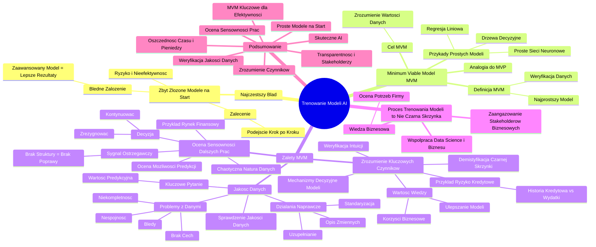

# Lekcje wideo - 6. Cykl życia projektu AI Wytrenuj model

# 💡 Diagram

___

# 🗒️ Notatka

# Notatki i Podsumowanie: Trenowanie Modeli AI 🤖

## Wprowadzenie

Ten materiał omawia kluczowy etap w tworzeniu sztucznej inteligencji - **trenowanie modeli AI**. Podkreśla powszechny błąd polegający na rozpoczynaniu procesu od zbyt skomplikowanych modeli. Promuje podejście **Minimum Viable Model (MVM)**, czyli rozpoczęcie od prostych modeli w celu szybkiej weryfikacji danych i założeń.

## Trenowanie Modeli AI - Kluczowe Aspekty

### Najczęstszy Błąd: Zbyt Skomplikowane Modele na Start

- Wiele zespołów **błędnie zakłada**, że im bardziej zaawansowany model (np. wielowarstwowe sieci neuronowe), tym lepsze rezultaty osiągną.
- **Prawda jest inna**: Rozpoczynanie od złożonych modeli typu "czarna skrzynka" jest ryzykowne i nieefektywne.
- **Zalecenie**: Przyjęcie metodycznego podejścia krok po kroku, zaczynając od prostych rozwiązań.

### Minimum Viable Model (MVM)

- **Definicja MVM**: Najprostszy model, który umożliwia sprawdzenie, czy dane w ogóle pozwalają na przewidywanie interesujących nas zjawisk.
- **Analogia do MVP (Minimum Viable Product)** ze świata startupów 🚀: MVM jest odpowiednikiem MVP w dziedzinie AI.
- **Przykłady prostych modeli**:
    - Regresja liniowa
    - Drzewa decyzyjne
    - Proste sieci neuronowe
- **Cel MVM**: Szybkie zrozumienie, czy dane są wartościowe i czy dalsze prace mają sens.

### Zalety MVM

MVM oferuje **trzy kluczowe korzyści**, które pomagają uniknąć błędnych inwestycji czasu 🕰️ i zasobów:

#### 1. Jakość Danych 📊

- **Sprawdzenie jakości danych**: MVM pozwala ocenić, czy dane są wystarczająco dobre, zanim zainwestuje się w bardziej złożone modele.
- **Problemy z danymi**: Mogą obejmować niekompletność, błędy, niespójność oraz brak istotnych cech.
- **Działania naprawcze**:  Koncentrują się na uzupełnianiu brakujących wartości, standaryzacji formatów i lepszym opisie zmiennych.
- **Kluczowe pytanie**: Czy dane faktycznie niosą wartość predykcyjną?

#### 2. Zrozumienie Kluczowych Czynników 🔍

- **Zrozumienie mechanizmów decyzyjnych modelu**: MVM umożliwia identyfikację czynników (zmiennych) o największym wpływie na predykcje.
- **Demistyfikacja "czarnej skrzynki"** 🪞: Na początkowym etapie kluczowe jest zrozumienie, jak model podejmuje decyzje.
- **Weryfikacja intuicji**: Może okazać się, że zmienne uważane za istotne, wcale takie nie są, podczas gdy inne, mniej oczywiste cechy, mają większy wpływ.
- **Przykład**: W modelu oceny ryzyka kredytowego 🏦, historia kredytowa może być mniej istotna niż miesięczne wydatki.
- **Wartość wiedzy**: Pozyskana wiedza umożliwia ulepszanie modelu i przynosi korzyści dla biznesu.

#### 3. Ocena Sensowności Dalszych Prac 🤔

- **Ocena możliwości predykcji**: MVM pozwala zweryfikować, czy dany problem w ogóle da się skutecznie rozwiązać za pomocą AI.
- **Chaotyczna natura danych**: Zależności w danych bywają niestabilne lub chaotyczne, co uniemożliwia skuteczną predykcję.
- **Sygnał ostrzegawczy** ⚠️: Jeśli prosty model nie wykazuje żadnej struktury w danych, bardziej zaawansowane metody prawdopodobnie również nie przyniosą poprawy.
- **Przykład**: Przewidywanie rynku finansowego 📈 –  często charakteryzuje się brakiem powtarzalnych informacji w danych.
- **Decyzja**: Na podstawie MVM można podjąć świadomą decyzję, czy kontynuować projekt i rozwijać model, czy zrezygnować i poszukać alternatywnego podejścia.

### Proces Trenowania Modeli to Nie "Czarna Skrzynka" 💡

- **Zaangażowanie stakeholderów biznesowych**: Proces trenowania modelu nie jest magiczną "czarną skrzynką", lecz wymaga współpracy.
- **Współpraca Data Science i Biznesu** 🤝: Wymaga zaangażowania zarówno ekspertów technicznych, jak i osób zorientowanych biznesowo.
- **Wiedza biznesowa**: Stakeholderzy biznesowi posiadają wiedzę niezbędną do oceny, czy model faktycznie odpowiada na potrzeby firmy i rozwiązuje realne problemy.

## Podsumowanie

Rozpoczęcie trenowania modeli AI od **Minimum Viable Model (MVM)** jest kluczowe dla efektywnego i oszczędnego podejścia. Zamiast inwestować od razu w skomplikowane sieci neuronowe, zaleca się start od prostych modeli, takich jak regresja liniowa czy drzewa decyzyjne. MVM umożliwia **szybką weryfikację jakości danych**, **zrozumienie kluczowych czynników wpływających na predykcje** oraz **ocenę sensowności dalszych prac**.  Co więcej, proces trenowania modeli AI powinien być transparentny i angażować **stakeholderów biznesowych**, aby zapewnić jego adekwatność do potrzeb firmy. Podejście MVM to **oszczędność czasu 🕰️ i pieniędzy 💰**, a przede wszystkim **lepsza droga do zbudowania skutecznie działającego AI** ✅.

___

# 🔉 Transcript
File: Lekcje wideo - 6. Cykl życia projektu AI Wytrenuj model.mp4 
[00:00:05] Czas na moment, na który wszyscy czekają. Trenowanie modelu AI.
[00:00:10] To tutaj maszyna zaczyna uczyć się na podstawie dostarczonych danych i dostosowywać swoje predykcje.
[00:00:16] Najczęstszy błąd? Zbyt skomplikowane modele na samym początku.
[00:00:20] (Ekran: Slajd z tytułem "Trenowanie modeli". Pod tytułem "Zacznij tak:" znajdują się wykresy i diagramy. Pod tytułem "Nie tak:" znajdują się schematy sieci neuronowych.)
[00:00:20] Wiele zespołów od razu chce trenować wielowarstwowe sieci neuronowe, myśląc, że im bardziej zaawansowany model, tym lepiej. A prawda jest zupełnie inna.
[00:00:29] Zamiast zaczynać od czegoś, co jest czarną skrzynką, lepiej podejść do tego metodycznie.
[00:00:34] Na początek proste modele: regresja liniowa, drzewa decyzyjne, proste sieci neuronowe. Po co?
[00:00:40] Bo dzięki nim możemy szybko zrozumieć, czy nasze dane faktycznie pozwalają przewidzieć to, na czym nam zależy.
[00:00:47] To jest zasada Minimum Viable Model, MVM. Tak jak w startupach mówi się o Minimum Viable Product, czyli najprostszej wersji produktu, który pozwala sprawdzić, czy coś w ogóle ma sens.
[00:00:49] (Ekran: Slajd z tekstem "MVP = Minimum Viable Product" i "MVM = Minimum Viable Model".)
[00:00:57] Tak samo w AI zaczynamy od modelu, który jest łatwy do interpretacji i tani do wdrożenia.
[00:01:03] (Ekran: Slajd z tytułem "Minimum Viable Model". Pod tytułem znajdują się dwa punkty: "Nasz pierwszy model powinien być łatwy do interpretacji i tani do wdrożenia" oraz "Dzięki niemu dowiemy się:". Poniżej znajdują się trzy pytania w ramkach: "Czy dane do trenowania modelu są wystarczającej jakości?", "Jakie czynniki najmocniej wpływają na predykcje, np. cena?" i "Czy dalsze prace mają sens biorąc pod uwagę chaotyczną naturę zagadnienia, np. giełda?")
[00:01:03] Co daje nam MVM? Trzy kluczowe rzeczy, które pozwalają nam uniknąć błędnych inwestycji czasu i zasobów.
[00:01:10] Po pierwsze, sprawdzamy jakość danych, zanim zainwestujemy w bardziej skomplikowane modele. Jeśli dane są niekompletne, zawierają błędy, są niespójne lub nie mają wystarczającej liczby istotnych cech, nawet najlepszy model nie przyniesie wartości.
[00:01:23] Na tym etapie możemy zobaczyć, czy dane faktycznie niosą wartość predykcyjną i czy wymagają dodatkowego przetworzenia, na przykład tu uzupełniania brakujących wartości, standaryzacji formatów czy lepszego opisu zmiennych.
[00:01:35] Po drugie, MVM pozwala nam zrozumieć, jakie czynniki najmocniej wpływają na predykcję.
[00:01:40] AI często postrzegane jest jako czarna skrzynka, ale na początkowym etapie kluczowe jest zrozumienie mechanizmów decyzyjnych modelu.
[00:01:48] Może się okazać, że zmienne, które uznawaliśmy za istotne, w rzeczywistości nie mają dużego wpływu, a za prognozę odpowiadają inne, mniej oczywiste cechy. Jeśli na przykład budujemy model oceniający ryzyko kredytowe, możemy odkryć, że historia kredytowa jest mniej istotna niż poziom miesięcznych wydatków klienta.
[00:02:04] Taka wiedza jest bezcenna zarówno dla ulepszania modelu, jak i dla biznesu.
[00:02:09] Po trzecie, MVM pozwala nam ocenić, czy dalsze prace mają sens i czy predykcja jest w ogóle możliwa.
[00:02:15] Nie wszystkie problemy da się skutecznie rozwiązać za pomocą AI, a czasami zależności w danych są zbyt chaotyczne lub niestabilne. Jeśli na etapie prostego modelu widzimy, że nie ma żadnej wyraźnej struktury w danych, to wdrażanie bardziej zaawansowanych metod nie zmieni sytuacji.
[00:02:31] Przykładowo, jeśli próbujemy przewidzieć zachowanie rynku finansowego i okazuje się, że dane nie dają żadnej powtarzalnej informacji, nie ma sensu inwestować w kosztowne modele deep learningowe.
[00:02:41] Dzięki Minimum Viable Model możemy więc podjąć decyzję, czy idziemy dalej i udoskonalamy model, czy może lepiej zatrzymać projekt na tym etapie i poszukać innego podejścia.
[00:02:51] To szybkie, tanie i efektywne narzędzie do testowania realnej wartości AI w biznesie.
[00:02:57] (Ekran: Slajd z tekstem "Proces trenowania modelu to nie "black box". Stakeholderzy biznesowi także powinni być zaangażowani.")
[00:02:58] I jeszcze jedno. Proces trenowania modelu to nie Black Box. Często ludzie spoza zespołu Data Science traktują AI jak magię. Wkładasz dane, czekasz, potem masz wyniki.
[00:03:09] To błąd. Trenowanie modelu to proces, który wymaga zaangażowania nie tylko technicznych ekspertów, ale też ludzi z biznesu.
[00:03:17] Bo to oni wiedzą, czy model faktycznie odpowiada na potrzeby firmy.
[00:03:22] Podsumowując, nie zaczynajmy od najtrudniejszego. Zacznijmy od prostego modelu, który można łatwo zrozumieć, a potem stopniowo go rozwijajmy. To nie tylko oszczędność czasu i pieniędzy, ale też najlepszy sposób na zbudowanie AI, które faktycznie działa.
[00:03:37] (Ekran: Logo "Umiejętności Jutra AI" z logotypami Google i SGH.)

___
# 🏷️ Tags
#trenowanie_modeli_AI #AI #sztuczna_inteligencja #model_AI #uczenie_maszynowe #Minimum_Viable_Model #MVM #MVP #regresja_liniowa #drzewa_decyzyjne #sieci_neuronowe #jakość_danych #dane #predykcja #analiza_danych #czynniki_predykcyjne #ryzyko_kredytowe #rynek_finansowy #deep_learning #Data_Science #biznes #stakeholderzy_biznesowi #współpraca_Data_Science_i_Biznesu #efektywność #oszczędność_czasu #oszczędność_pieniędzy #czarna_skrzynka #black_box #wiedza_biznesowa #weryfikacja_danych #walidacja_danych #modele_predykcyjne #algorytmy_AI #uczenie_modeli #rozwoj_modeli #budowanie_AI #umiejętności_Jutra_AI
