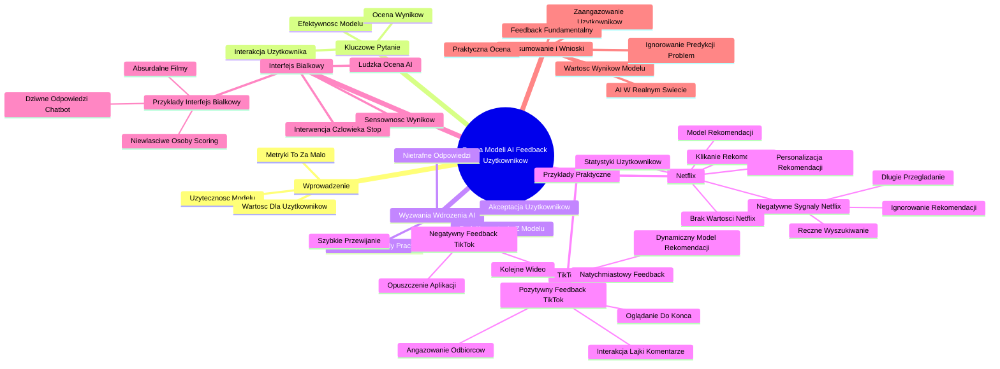

# Lekcje wideo - 7. Cykl życia projektu AI Zdobądź feedback

# 💡 Diagram

___

# 🗒️ Notatka

# Notatki i Podsumowanie: Ocena Modeli AI poprzez Feedback Użytkowników

## Wprowadzenie

Ta notatka omawia kluczowy aspekt weryfikacji modeli sztucznej inteligencji (AI) - **feedback użytkowników**. Podkreśla, że wdrożenie modelu i osiągnięcie dobrych metryk (jak `accuracy` i `precision`) to za mało. Najważniejsza jest **użyteczność** modelu i generowanie wartościowych wyników dla użytkowników. Materiał koncentruje się na ocenie, czy model realnie spełnia swoje zadanie w praktyce.

## Kluczowe Pytanie: Czy Model Działa Efektywnie? 🤔

*   Po stworzeniu modelu AI, pojawia się fundamentalne pytanie: **\"Jak zweryfikować, czy model efektywnie spełnia swoje zadanie?\"**
*   Nie wystarczy polegać wyłącznie na metrykach technicznych.
*   Kluczowe jest skupienie się na **interakcji użytkowników** z modelem i oceną jego wyników.

## Wyzwania Wdrożenia AI i Akceptacja Użytkowników

*   Samo wdrożenie AI nie gwarantuje sukcesu.
*   **Użytkownicy muszą chcieć korzystać** z modelu i jego rekomendacji.
*   Przykład: Model wspierający agentów obsługi klienta 🧑‍💼.
    *   Jeśli agenci **nie korzystają** z rekomendacji modelu, sygnalizuje to problem.
    *   Potencjalne przyczyny:
        *   Model generuje **nietrafne odpowiedzi**.
        *   Agenci preferują **tradycyjne metody pracy**.

## Przykłady Praktyczne: Netflix i TikTok 🎬📱

### Netflix - Model Rekomendacji Filmów i Seriali 🍿

*   Model rekomendacji Netflixa jest uznawany za skuteczny, ale jak to potwierdzić?
*   **Analiza statystyk** jest pomocna, lecz **najprostszym testem** jest sprawdzenie, czy użytkownicy **klikają w proponowane tytuły**.
*   **Negatywne sygnały:**
    *   Użytkownik **ignoruje rekomendacje** w danej kategorii.
    *   Użytkownik **ręcznie wyszukuje treści**.
    *   Użytkownik **długo przegląda listę** bez wyboru.
*   Te zachowania wskazują, że model **nie dostarcza wartości** i **nie personalizuje rekomendacji**.

### TikTok - Dynamiczny Model Rekomendacji Wideo 📹

*   TikTok to jeszcze bardziej dynamiczny przykład.
*   Model AI **decyduje o kolejnym wyświetlanym wideo**.
*   **Feedback jest natychmiastowy i bezkompromisowy.**
*   **Negatywny feedback:**
    *   Użytkownik **szybko przewija** nietrafne wideo.
    *   Użytkownik **opuszcza aplikację**.
*   **Pozytywny feedback:**
    *   Użytkownik **ogląda wideo do końca**, **interaguje** (lajkuje 👍, komentuje 💬, udostępnia 📤).
*   TikTok pokazuje, że **AI musi angażować i przyciągać uwagę odbiorców**.

## Interfejs Białkowy - Ludzka Weryfikacja Wyników AI 🧠

*   Feedback to nie tylko dane ilościowe. Ważna jest **ludzka ocena** wyników AI, tzw. **\"interfejs białkowy\"**.
*   Należy **osobiście analizować predykcje modelu** i ocenić ich **sensowność**.
*   Przykłady sytuacji, gdzie ludzka ocena jest kluczowa:
    *   Model rekomenduje **absurdalne filmy**.
    *   Chatbot udziela **dziwnych odpowiedzi**.
    *   Algorytm scoringowy **faworyzuje nieodpowiednie osoby**.
*   W takich przypadkach **interwencja człowieka jest niezbędna** ("stop! ✋").

## Podsumowanie i Kluczowe Wnioski 📝

*   **Zbieranie feedbacku** to więcej niż analiza metryk.
*   Najważniejsza jest **praktyczna ocena**, czy użytkownicy:
    *   **Angażują się** w interakcję z modelem.
    *   Uznają **wyniki modelu za wartościowe**.
*   **AI funkcjonuje w realnym świecie**, nie w izolacji.
*   Ignorowanie predykcji AI to **sygnał problemu**, który wymaga interwencji.
*   **Feedback użytkowników jest fundamentalny** dla weryfikacji i doskonalenia modeli AI.

---

*Logo \"Umiejętności Jutra AI\" z logotypami Google i SGH.*

___

# 🔉 Transcript
File: Lekcje wideo - 7. Cykl życia projektu AI Zdobądź feedback.mp4 
[00:00:05] Kiedy już mamy nasz model, pora na moment próby. Trzeba go pokazać użytkownikom i zdobyć od nich feedback.
[00:00:12] Ale skąd właściwie wiemy, czy nasz model faktycznie działa? I nie chodzi tylko o metryki jak accuracy i precision, ale o coś bardziej fundamentalnego. Czy ludzie faktycznie korzystają z wyników modelu i czy te wyniki mają sens?
[00:00:25] (Ekran: Białe tło z pytaniem "W jaki sposób będziemy wiedzieli, czy model spełnia swoje zadanie?" oraz kolorowe elementy graficzne.)
[00:00:26] A na koniec dnia liczy się interakcja użytkownika. Jeśli mamy model wspierający agentów obsługi klienta, ale nikt nie korzysta z jego rekomendacji, to znaczy, że coś poszło nie tak. Może model generuje nietrafione odpowiedzi, może agentom wygodniej jest działać po staremu. Samo wdrożenie AI nie gwarantuje, że ludzie będą chcieli z niego korzystać.
[00:00:44] (Ekran: Strona główna Netflixa z różnymi filmami i serialami.)
[00:00:45] Weźmy przykład Netflixa. Model rekomendacji działa świetnie, ale czy na pewno? Możemy analizować statystyki, ale najprostszy test to po prostu sprawdzenie, czy użytkownicy klikają w proponowane filmy. Jeśli rekomendacje w danej kategorii są nietrafione, użytkownik je ignoruje albo wyszukuje czegoś ręcznie. A jeśli użytkownik przewija długo listę i nie wybiera nic, to oznacza, że model nie dostarcza wartości, a w efekcie nie uczy się preferencji użytkownika.
[00:01:10] (Ekran: Dwa zrzuty ekranu z aplikacji TikTok. Na jednym z nich widać kota, a na drugim kobietę. Na obu ekranach widoczne są opcje interakcji, takie jak "Not interested", "Save video", "Add to Favorites".)
[00:01:11] Jeszcze bardziej dynamiczny przykład to TikTok. Model AI decyduje, co użytkownik zobaczy jako następne. I nie da się tutaj oszukać. Jeśli film jest nietrafiony, użytkownik szybko przesuwa dalej lub, co gorsza, wychodzi z aplikacji. To jest najważniejsza informacja zwrotna, czyli AI rzeczywiście przyciąga uwagę i angażuje odbiorców.
[00:01:31] Ale feedback to nie tylko dane ilościowe. Jest jeszcze coś, co nazywamy interfejsem białkowym, czyli ludzką oceną wyników AI. Warto spojrzeć na predykcje modelu własnym okiem i sprawdzić, czy mają sens. Jeśli model rekomenduje absurdalne filmy, jeśli chatbot proponuje dziwne odpowiedzi, jeśli algorytm scoringowy faworyzuje niewłaściwe osoby, ktoś musi to zauważyć i powiedzieć stop.
[00:01:57] Podsumowując, zbieranie feedbacku to nie tylko analiza metryk, ale realna ocena, czy użytkownicy wchodzą w interakcję z modelem i czy jego wyniki mają wartość. AI nie istnieje w próżni. Jeśli jego predykcje są ignorowane, to znaczy, że mamy problem, który trzeba rozwiązać.
[00:02:13] (Ekran: Logo "Umiejętności Jutra AI" z logotypami Google i SGH.)

___
# 🏷️ Tags
#feedback #model_AI #sztuczna_inteligencja #AI #użyteczność #accuracy #precision #interakcja_użytkownika #wdrożenie_AI #akceptacja_użytkowników #rekomendacje #Netflix #TikTok #model_rekomendacji #statystyki #personalizacja_rekomendacji #zaangażowanie_odbiorców #interfejs_białkowy #ludzka_ocena #predykcje_modelu #sensowność #chatbot #algorytm_scoringowy #analiza_metryk #wartość_modelu #Umiejętności_Jutra_AI #Google #SGH
