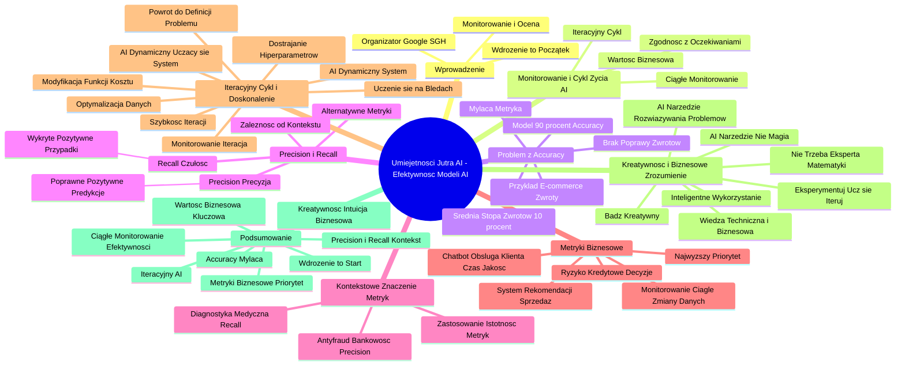

# Lekcje wideo - 8. Cykl życia projektu AI Monitoruj

# 💡 Diagram

___

# 🗒️ Notatka

# Notatki i Sumaryzacja Prezentacji Wideo: Umiejętności Jutra AI - Efektywność Modeli AI

## Wprowadzenie

Prezentacja "Umiejętności Jutra AI" zorganizowana przez Google i SGH koncentruje się na kluczowym aspekcie projektów AI: **monitorowaniu i ocenie efektywności wdrożonych modeli**. Wojciech Strzałkowski wyjaśnia, że wytrenowanie i wdrożenie modelu to dopiero początek. Kluczowe jest zrozumienie, czy model działa zgodnie z założeniami i przynosi realną wartość biznesową.

## Monitorowanie i Cykl Życia Projektu AI

*   **Wdrożenie to początek, a nie koniec procesu.** Po implementacji modelu AI, ciągłe monitorowanie jego działania jest niezbędne.
*   **Sprawdzanie zgodności z oczekiwaniami:** Czy model funkcjonuje zgodnie z pierwotnymi założeniami?
*   **Generowanie wartości biznesowej:** Czy model realnie przyczynia się do realizacji celów firmy?
*   **Cykl życia projektu AI jest iteracyjny.** Monitorowanie stanowi punkt wyjścia dla kolejnych iteracji i ulepszeń.

## Problem z Metryką `Accuracy`: Przykład Zwrotów w E-commerce 🛍️

*   **Przykład z firmy e-commerce:** Model predykcji prawdopodobieństwa zwrotu produktu.
*   **Średnia stopa zwrotów:** 10%.
*   **Cel modelu:** Identyfikacja zamówień z wysokim ryzykiem zwrotu, w celu optymalizacji logistyki i redukcji kosztów.
*   **Wytrenowany model z `accuracy` na poziomie 90%.** Na pierwszy rzut oka, wynik wydaje się obiecujący.
*   **Brak poprawy wskaźnika zwrotów po wdrożeniu.** Pomimo wysokiej `accuracy`, model nie generuje oczekiwanych rezultatów biznesowych.
*   **Analiza `Accuracy`:**
    *   `Accuracy` mierzy procent poprawnych predykcji we **wszystkich** przypadkach.
    *   Model z 90% `accuracy` przewiduje brak zwrotu w 100% przypadków, myląc się w 10% (co odpowiada średniej stopie zwrotów).
    *   Model **nie identyfikuje ryzykownych zamówień**, a jedynie powiela statystykę, zakładając, że klienci nie będą zwracać produktów.
*   **Wniosek:** Wysoka `accuracy` nie zawsze przekłada się na efektywność modelu w kontekście konkretnego problemu biznesowego. `Accuracy` może być **myląca** i **nadużywana** przez dostawców rozwiązań AI.

## `Precision` i `Recall`: Bardziej Adekwatne Metryki Efektywności

*   **Alternatywne metryki:** `Precision` (precyzja) i `Recall` (czułość).
*   **Wzajemna zależność:** `Precision` i `Recall` opisują różne aspekty skuteczności modelu i są ze sobą powiązane.
*   **Definicje:**
    *   **`Precision` (Precyzja):**  Procent poprawnych **pozytywnych** predykcji. Określa, na ile możemy polegać na pozytywnych wskazaniach modelu.
        > Innymi słowy: Jeśli model przewidział zwrot, jak często miał rację?
    *   **`Recall` (Czułość):** Procent **rzeczywiście** wykrytych przypadków pozytywnych. Informuje nas, ile rzeczywistych pozytywnych przypadków model poprawnie zidentyfikował.
        > Innymi słowy: Czy model skutecznie wykrywa większość problematycznych zamówień (zwrotów)?
*   **W kontekście zwrotów e-commerce:**  `Recall` nabiera **większego znaczenia**. Zależy nam, aby model wychwytywał **większość** potencjalnych zwrotów, nawet kosztem ewentualnych fałszywych alarmów. Niska czułość oznacza, że model ignoruje zwroty, co uniemożliwia podjęcie działań zapobiegawczych.

## Kontekstowe Znaczenie `Precision` i `Recall`

*   **Zastosowanie determinuje istotność metryk.** Wybór ważniejszej metryki zależy od konkretnego zastosowania modelu.
*   **Modele antyfraudowe w bankowości:** `Precision` staje się **kluczowa**.
    > Lepiej wskazać mniej transakcji jako podejrzane, ale mieć pewność, że są to rzeczywiste oszustwa. Fałszywe alarmy mogą być bardzo problematyczne dla klientów.
*   **Diagnostyka medyczna 🩺:** `Recall` jest **decydująca**.
    > Lepiej skierować kilka zdrowych osób na dodatkowe badania, niż przeoczyć pacjenta z poważną chorobą. Przeoczenie choroby niesie poważniejsze konsekwencje niż dodatkowe badania dla osób zdrowych.

## Metryki Biznesowe Mają Najwyższy Priorytet 🥇

*   **`Precision` i `Recall` to istotne wskaźniki, ale nie jedyne.** Warto o nie pytać, jednak to **metryki biznesowe** ostatecznie decydują o sukcesie wdrożenia modelu.
*   **Przykłady metryk biznesowych:**
    *   System rekomendacji: Czy **zwiększa sprzedaż 📈**?
    *   Model oceny ryzyka kredytowego: Czy usprawnia **proces podejmowania decyzji kredytowych 🏦**?
    *   Chatbot obsługi klienta: Czy **oszczędza czas 🕰️**, **podnosi jakość obsługi klienta**, czy generuje wzrost liczby połączeń na infolinię?
*   **Monitorowanie AI to proces ciągły.** Zmiany w danych i zachowaniach użytkowników wymagają stałej analizy wyników. Bez monitorowania, model może stracić **użyteczność biznesową**, nawet przy poprawnym działaniu technicznym.

## Iteracyjny Cykl Życia AI i Doskonalenie Modeli

*   **Monitorowanie inicjuje kolejną iterację.** Analiza wyników stanowi podstawę do wprowadzania ulepszeń.
*   **AI to system dynamiczny, uczący się.** Musi adaptować się do zmieniających się danych i preferencji użytkowników.
*   **Powrót do definicji problemu:**
    *   Czy model nadal efektywnie rozwiązuje pierwotny problem?
    *   Czy ewoluowały potrzeby biznesowe?
    *   Czy zidentyfikowano nowe wzorce w danych lub zmiany w zachowaniu użytkowników?
*   **Uczenie się na błędach i udoskonalanie:**
    *   Optymalizacja danych wejściowych.
    *   Dostrajanie hiperparametrów.
    *   Modyfikacja funkcji kosztu.
    *   Zmiana podejścia do problemu.
*   **Cykl iteracyjny:** Testowanie, ulepszanie, dostosowywanie - **niekończąca się pętla 🔄**.
*   **Szybkość iteracji ma kluczowe znaczenie.** Im szybszy cykl iteracji, tym lepiej.
*   **AI najefektywniej funkcjonuje jako dynamiczny system uczący się.**

## Kreatywność i Zrozumienie Biznesowe w AI 💡

*   **Kluczowa myśl:** **Bądź kreatywny!**
*   **AI to nie tylko matematyka i kod 💻.** To **narzędzie do rozwiązywania problemów** w biznesie, nauce i życiu codziennym.
*   **Nie trzeba być ekspertem matematyki, aby pracować z AI.** Istotne jest **zrozumienie problemów** i **umiejętność zadawania trafnych pytań**.
*   **Najbardziej wartościowe projekty AI:** Rodzą się z połączenia **wiedzy technicznej** z **intuicją biznesową** i **kreatywnym myśleniem**.
*   **Zachęta do działania:** Eksperymentuj, ucz się, kwestionuj wyniki, iteruj.
*   **AI to narzędzie, a nie magia ✨.** Najlepiej działa, gdy rozumiemy jego potencjał i ograniczenia.
*   **Kluczowe jest inteligentne wykorzystanie technologii AI.**

## Podsumowanie

Prezentacja podkreśla, że **wdrożenie modelu AI to dopiero początek drogi 🚀**. Kluczowe staje się **ciągłe monitorowanie i ocena efektywności**, uwzględniająca nie tylko aspekty techniczne, ale przede wszystkim **wartość biznesową**. Metryka `accuracy` może wprowadzać w **błąd**, a bardziej miarodajnymi wskaźnikami są `precision` i `recall`, których waga zależy od **konkretnego zastosowania**. Najistotniejsze pozostają jednak **metryki biznesowe**, które realnie odzwierciedlają, czy model przynosi oczekiwane korzyści. Projekty AI mają charakter **iteracyjny**, wymagając nieustannego **udoskonalania i adaptacji** do zmieniających się danych i potrzeb. Ostatecznie, w pracy z AI kluczową rolę odgrywa **kreatywność, intuicja biznesowa oraz umiejętność mądrego korzystania z technologii**, a nie tylko zaawansowana wiedza matematyczna.

___

# 🔉 Transcript
File: Lekcje wideo - 8. Cykl życia projektu AI Monitoruj.mp4 
[00:00:01] Ekran: Białe tło z pionową czarną kreską.
[00:00:01] Ekran: Napis "Umiejętności Jutra" z dopiskiem "AI" po prawej stronie.
[00:00:03] Ekran: Napis "Umiejętności Jutra AI" z dopiskiem "Organizator Google" i "Partner edukacyjny SGH" na dole.
[00:00:05] Ekran: Mężczyzna w niebieskiej koszuli siedzi za biurkiem.
[00:00:05] Wojciech Strzałkowski: Trenujemy model, wdrażamy go do systemu i co dalej?
[00:00:08] Wojciech Strzałkowski: Czy możemy już uznać, że AI działa poprawnie?
[00:00:12] Wojciech Strzałkowski: Oczywiście, że nie.
[00:00:13] Wojciech Strzałkowski: Samo wdrożenie to dopiero początek.
[00:00:16] Ekran: Mężczyzna w niebieskiej koszuli siedzi za biurkiem. Po prawej stronie ekranu znajduje się diagram kołowy z napisem "Cykle życia projektu AI".
[00:00:16] Wojciech Strzałkowski: Teraz kluczowe jest monitorowanie.
[00:00:18] Wojciech Strzałkowski: Sprawdzanie czy model działa zgodnie z oczekiwaniami i czy faktycznie generuje wartość biznesową.
[00:00:24] Ekran: Mężczyzna w niebieskiej koszuli siedzi za biurkiem. Po prawej stronie ekranu znajduje się slajd z napisem "Jak rozumieć efektywność modeli AI?".
[00:00:24] Wojciech Strzałkowski: Załóżmy, że dla firmy e-commerce wytrenowaliśmy model określający prawdopodobieństwo zwrotu zamówionego produktu.
[00:00:31] Wojciech Strzałkowski: Średnia stopa zwrotów wynosi 10%.
[00:00:34] Wojciech Strzałkowski: Naszym celem jest stworzenie modelu, który podpowie nam, które zamówienia są zagrożone zwrotem zanim to się stanie.
[00:00:40] Wojciech Strzałkowski: Co pozwoli firmie lepiej zarządzać logistyką i obniżyć koszty.
[00:00:44] Ekran: Mężczyzna w niebieskiej koszuli siedzi za biurkiem. Po prawej stronie ekranu znajduje się slajd z napisem "Wytrenowany model posiada 90% Accuracy".
[00:00:44] Wojciech Strzałkowski: Po wdrożeniu brak poprawy wskaźnika zwrotów.
[00:00:45] Wojciech Strzałkowski: Po wdrożeniu modelu sprawdzamy jego skuteczność i okazuje się, że ma 90% accuracy.
[00:00:50] Wojciech Strzałkowski: Brzmi świetnie, prawda?
[00:00:51] Wojciech Strzałkowski: Problem w tym, że po wdrożeniu nie widzimy żadnej poprawy wskaźnika zwrotów.
[00:00:56] Wojciech Strzałkowski: Co poszło nie tak?
[00:00:58] Ekran: Mężczyzna w niebieskiej koszuli siedzi za biurkiem. Po prawej stronie ekranu znajduje się slajd z napisem "Wytrenowany model posiada 90% Accuracy = Przewiduje brak zwrotu w 100% wypadków, a więc myli się w 10%. 100%-10%=90%".
[00:00:58] Wojciech Strzałkowski: Accuracy opisuje nam, w ilu % wszystkich wypadków, model był w stanie zrobić prawidłową predykcję.
[01:02] Wojciech Strzałkowski: Natomiast nas interesują tylko wypadki zagrożone zwrotem!
[01:03] Wojciech Strzałkowski: Nasz model przewiduje brak zwrotu w 100% przypadków, co oznacza, że myli się w 10%, czyli dokładnie tyle ile wynosi średnia stopa zwrotów.
[01:07] Wojciech Strzałkowski: Czyli tak naprawdę nie robi nic poza powielaniem statystyki.
[01:10] Wojciech Strzałkowski: Nie wyłapuje ryzykownych zamówień, tylko zakłada, że każdy klient zatrzyma swój produkt.
[01:15] Wojciech Strzałkowski: To świetny przykład tego, dlaczego accuracy nie jest zawsze dobrą metryką oceny skuteczności modelu.
[01:21] Wojciech Strzałkowski: Accuracy mierzy ile procent wszystkich przewidywań było poprawnych, ale nie mówi nam nic o tym, czy model dobrze identyfikuje istotne przypadki.
[01:30] Ekran: Mężczyzna w niebieskiej koszuli siedzi za biurkiem. Po prawej stronie ekranu znajduje się slajd z napisem "Zamiast tego lepiej użyć precision i recall".
[01:30] Wojciech Strzałkowski: Precision (precyzja) i recall (czułość) to dwie wzajemnie zależne od siebie metryki opisujące:
[01:34] Wojciech Strzałkowski: Precision = % poprawnych predykcji.
[01:34] Wojciech Strzałkowski: Recall = % wykrytych przypadków.
[01:35] Wojciech Strzałkowski: Dlatego w praktyce często ważniejsze są precision i recall.
[01:35] Wojciech Strzałkowski: Precyzja, precision, mówi nam jak bardzo możemy ufać pozytywnym predykcjom modelu.
[01:39] Wojciech Strzałkowski: Jeśli model przewidział, że dany klient zwróci produkt, to jak często miał rację?
[01:44] Wojciech Strzałkowski: Czułość, czyli recall, mówi ile rzeczywistych zwrotów model był w stanie poprawnie przewidzieć.
[01:50] Wojciech Strzałkowski: Czy rzeczywiście wykrywa większość problematycznych zamówień?
[01:54] Wojciech Strzałkowski: W naszym przypadku dużo bardziej istotna jest czułość.
[01:56] Wojciech Strzałkowski: Chcemy, aby model rzeczywiście wykrywał zagrożone zamówienia.
[01:59] Wojciech Strzałkowski: Jeśli czułość jest niska, to model ignoruje zwroty, a my nie jesteśmy w stanie podjąć żadnych działań zapobiegawczych.
[02:06] Wojciech Strzałkowski: To, która metryka ma większe znaczenie zależy od zastosowania.
[02:09] Wojciech Strzałkowski: W modelach antyfraudowych dla banków, precyzja jest kluczowa.
[02:13] Wojciech Strzałkowski: Lepiej oznaczyć mniej transakcji jako podejrzane, ale mieć pewność, że są to faktycznie próby oszustwa.
[02:19] Wojciech Strzałkowski: Natomiast w diagnostyce medycznej liczy się czułość.
[02:22] Wojciech Strzałkowski: Lepiej wysłać kilka zdrowych osób na dodatkowe badania, niż przeoczyć pacjenta z poważną chorobą.
[02:28] Wojciech Strzałkowski: Podsumowując, accuracy to jedna z najczęściej nadużywanych metryk przez dostawców AI.
[02:32] Wojciech Strzałkowski: Może brzmieć dobrze w prezentacjach, ale w rzeczywistości nie zawsze mówi nam czy model spełnia swoje zadanie.
[02:37] Wojciech Strzałkowski: Dlatego warto patrzeć szerzej i analizować, czy model naprawdę przynosi wartość biznesową, czy tylko wygląda dobrze w statystykach.
[02:44] Wojciech Strzałkowski: Precision i recall mogą wydawać się nieintuicyjne na pierwszy rzut oka, ale są niezwykle istotne w ocenie skuteczności modeli AI.
[02:51] Wojciech Strzałkowski: Zachęcam do samodzielnego zgłębienia tych metryk, ponieważ ich zrozumienie pozwala lepiej interpretować wyniki modeli i podejmować świadome decyzje o ich optymalizacji.
[03:00] Ekran: Mężczyzna w niebieskiej koszuli siedzi za biurkiem. Po prawej stronie ekranu znajduje się slajd z napisem "Na koniec dnia najważniejsze są metryki biznesowe".
[03:00] Wojciech Strzałkowski: Warto pytać o precision i recall, ale to nie one decydują o sukcesie modelu.
[03:05] Wojciech Strzałkowski: Czy system rekomendacji faktycznie zwiększa sprzedaż?
[03:08] Wojciech Strzałkowski: Czy model oceny ryzyka kredytowego rzeczywiście pozwala podejmować lepsze decyzje?
[03:13] Wojciech Strzałkowski: Czy chatbot obsługi klienta oszczędza czas i poprawia jakość obsługi, czy może sprawia, że klienci częściej dzwonią na infolinię?
[03:20] Wojciech Strzałkowski: Monitorowanie AI to ciągły proces.
[03:22] Wojciech Strzałkowski: Dane się zmieniają, zachowania użytkowników się zmieniają, więc jeśli nie będziemy stale analizować wyników, możemy skończyć z systemem, który działa poprawnie pod względem technicznym, ale jest całkowicie bezużyteczny z biznesowego punktu widzenia.
[03:36] Ekran: Mężczyzna w niebieskiej koszuli siedzi za biurkiem. Po prawej stronie ekranu znajduje się diagram kołowy z napisem "Cykle życia projektu AI".
[03:37] Wojciech Strzałkowski: Monitorowanie modelu to nie koniec.
[03:39] Wojciech Strzałkowski: To dopiero początek kolejnej iteracji, ale AI nie jest systemem, który budujemy raz i zapominamy.
[03:45] Wojciech Strzałkowski: Dane się zmieniają, użytkownicy się zmieniają, a nasz model musi się do tego dostosowywać.
[03:51] Wojciech Strzałkowski: Po analizie wyników na produkcji wracamy do definicji problemu.
[03:55] Wojciech Strzałkowski: Czy model faktycznie rozwiązuje pierwotnie założony problem?
[03:58] Wojciech Strzałkowski: Czy może zmieniły się potrzeby biznesowe?
[04:01] Wojciech Strzałkowski: Może odkryliśmy nowe wzorce w danych, albo zauważyliśmy, że użytkownicy inaczej korzystają z systemu niż zakładaliśmy.
[04:09] Wojciech Strzałkowski: To moment, w którym uczymy się na błędach i udoskonalamy nasz model.
[04:13] Wojciech Strzałkowski: Możemy poprawić dane wejściowe, dostroić hiperparametry, zmodyfikować funkcję kosztu lub nawet zmienić całe podejście do problemu.
[04:21] Wojciech Strzałkowski: Cykl życia projektu AI to proces iteracyjny.
[04:23] Wojciech Strzałkowski: Niekończąca się pętla testowania, poprawiania i dostosowywania do rzeczywistości.
[04:30] Wojciech Strzałkowski: Im szybciej przechodzimy przez ten cykl, tym lepiej.
[04:33] Wojciech Strzałkowski: AI działa najlepiej wtedy, gdy nie traktujemy go jako statycznego rozwiązania, ale jako dynamiczny system uczący się wraz z nami.
[04:41] Wojciech Strzałkowski: Bo na końcu dnia nie chodzi o to by mieć dobry model, ale o to by dostarczać realną wartość biznesową i podejmować coraz lepsze decyzje.
[04:50] Ekran: Mężczyzna w niebieskiej koszuli siedzi za biurkiem. Po prawej stronie ekranu znajduje się slajd z napisem "Bądźcie kreatywni. Nie trzeba się znać na matematyce, by pracować z AI".
[04:51] Wojciech Strzałkowski: Na koniec chciałbym zostawić was z jedną kluczową myślą.
[04:54] Wojciech Strzałkowski: Bądźcie kreatywni!
[04:55] Wojciech Strzałkowski: Sztuczna inteligencja to nie tylko matematyka, modele i kod.
[04:58] Wojciech Strzałkowski: AI to przede wszystkim narzędzie do rozwiązywania problemów.
[05:02] Wojciech Strzałkowski: W biznesie, w nauce, w codziennym życiu.
[05:05] Wojciech Strzałkowski: Nie trzeba znać się na matematyce, by pracować z AI.
[05:08] Wojciech Strzałkowski: Trzeba rozumieć jakie pytania zadawać i jakie problemy warto rozwiązywać.
[05:13] Wojciech Strzałkowski: Najlepsze projekty AI powstają nie tam, gdzie ludzie perfekcyjnie znają algorytmy, ale tam gdzie potrafią połączyć wiedzę techniczną z biznesową intuicją i kreatywnym myśleniem.
[05:23] Wojciech Strzałkowski: Eksperymentujcie, uczcie się, kwestionujcie wyniki, iterujcie.
[05:27] Wojciech Strzałkowski: AI to nie magia.
[05:29] Wojciech Strzałkowski: To narzędzie, które działa najlepiej, kiedy dobrze rozumiemy jego możliwości i ograniczenia.
[05:35] Wojciech Strzałkowski: To co naprawdę ma znaczenie, to umiejętność mądrego korzystania z tej technologii.
[05:40] Wojciech Strzałkowski: Dzięki za wspólną podróż.
[05:41] Wojciech Strzałkowski: Teraz czas wykorzystać to w praktyce.
[05:44] Ekran: Napis "Umiejętności Jutra AI" z dopiskiem "Organizator Google" i "Partner edukacyjny SGH" na dole.

___
# 🏷️ Tags
#AI
#uczenie_maszynowe
#machine_learning
#model_AI
#efektywność_modeli_AI
#monitorowanie_AI
#cykl_życia_projektu_AI
#wartość_biznesowa
#metryki
#accuracy
#precision
#recall
#e-commerce
#zwroty_e-commerce
#predykcja_zwrotów
#logistyka
#koszty
#wskaźnik_zwrotów
#predykcja
#pozytywne_predykcje
#negatywne_predykcje
#fałszywe_alarmy
#modele_antyfraudowe
#bankowość
#diagnostyka_medyczna
#system_rekomendacji
#ryzyko_kredytowe
#chatbot
#obsługa_klienta
#iteracja
#udoskonalanie_modeli
#dane_wejściowe
#hiperparametry
#funkcja_kosztu
#kreatywność
#intuicja_biznesowa
#wiedza_techniczna
#rozwiązywanie_problemów
#SGH
#Google
#Wojciech_Strzałkowski
#optymalizacja
#użyteczność_biznesowa
