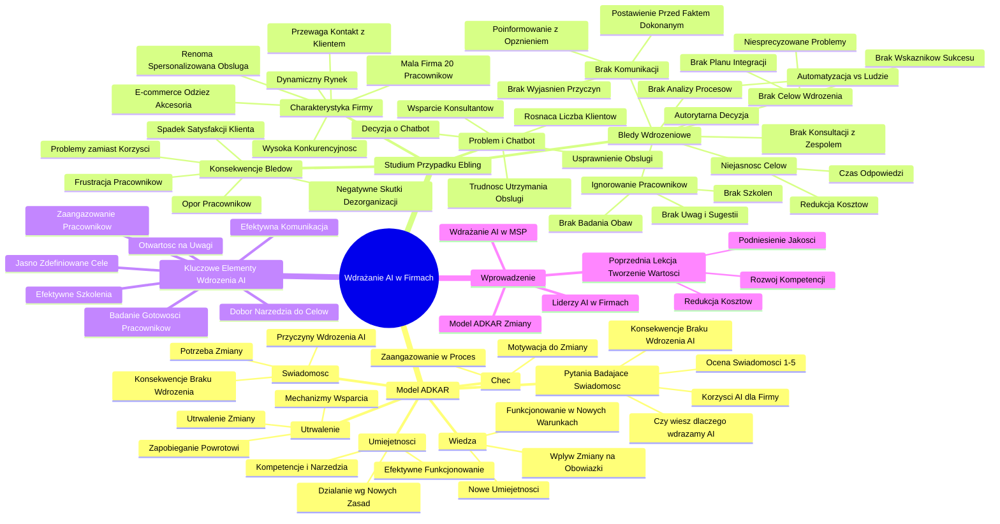

# Lekcje wideo - 1. Zarządzanie zmianą w praktyce – model ADKAR

# 💡 Diagram

___

# 🗒️ Notatka

# Notatki i Podsumowanie Lekcji: Wdrażanie Sztucznej Inteligencji w Firmach 🏢

## Wprowadzenie

Lekcja koncentruje się na wdrażaniu `sztucznej inteligencji` (AI) w małych i średnich przedsiębiorstwach (MŚP). Głównym celem jest zrozumienie **modelu ADKAR**, opisującego proces przechodzenia przez zmiany, oraz jego praktyczne zastosowanie we wdrażaniu AI. Uczestnikami projektu są liderzy AI w swoich firmach, których postawa i zaangażowanie są kluczowe dla pomyślnego wdrożenia. Przypomniano również o poprzedniej lekcji, która dotyczyła tworzenia wartości i generowania pomysłów na wykorzystanie AI w przedsiębiorstwach (redukcja kosztów 📉, podniesienie jakości 📈, rozwój nowych kompetencji 🧠).

## Studium Przypadku: Firma Ebling (E-commerce 🛒)

### Charakterystyka Firmy Ebling

* Branża: E-commerce, sprzedaż odzieży 👗 i akcesoriów online.
* Rynek: Dynamicznie rozwijający się, charakteryzujący się wysoką konkurencyjnością i rosnącymi oczekiwaniami klientów.
* Wielkość: Mała firma, zatrudniająca 20 pracowników.
* Renoma: Ugruntowana pozycja dzięki szybkiej i spersonalizowanej obsłudze klienta.
* Kluczowa przewaga konkurencyjna: Bezpośredni kontakt z klientem; konsultanci, znając stałych klientów i ich preferencje, budowali ich lojalność.

### Problem i Decyzja o Wdrożeniu Chatbota 🤖

* Rosnąca liczba klientów i zapytań.
* Utrzymanie dotychczasowego, wysokiego poziomu obsługi stawało się coraz trudniejsze i bardziej kosztowne 💸.
* Właściciele firmy dostrzegli w chatbotach opartych na AI szansę na usprawnienie obsługi klienta.
* Podjęto decyzję o wdrożeniu chatbota, aby wspomóc zespół w obsłudze rutynowych zapytań, umożliwiając konsultantom skupienie się na bardziej złożonych problemach.

### Błędy Wdrożeniowe i Ich Konsekwencje ⚠️

* **Autorytarna i nagła decyzja:** Właściciele, zakładając oczywistość potrzeby wdrożenia, pominęli konsultacje z zespołem.
* **Brak zdefiniowanych celów wdrożenia:**
    * Nie sprecyzowano konkretnych problemów, które chatbot miałby rozwiązać.
    * Nie określono wskaźników sukcesu.
    * Zabrakło planu integracji nowej technologii z istniejącym modelem obsługi.
* **Brak analizy procesów:** Nie zidentyfikowano procesów odpowiednich do automatyzacji ani tych, które powinny pozostać w gestii pracowników.
* **Niejasność celów:** Nie określono priorytetów – redukcja kosztów, skrócenie czasu odpowiedzi, czy inne cele.
* **Całkowity brak komunikacji z zespołem:**
    * Pracownicy zostali postawieni przed faktem dokonanym.
    * Poinformowano o wdrożeniu chatbota z dwutygodniowym wyprzedzeniem, poprzez ogłoszenie na stronie internetowej.
    * Nie wyjaśniono przyczyn zmiany, korzyści dla firmy ani wpływu na ich pracę.
* **Ignorowanie pracowników:**
    * Nie zbadano obaw i oczekiwań pracowników.
    * Nie zapewniono szkoleń z obsługi panelu administracyjnego chatbota (konfiguracja, scenariusze rozmów, monitorowanie).
    * Zablokowano możliwość zgłaszania uwag i sugestii.
    * Pracownicy poczuli się ignorowani i pozbawieni wpływu na zmiany.
* **Skutki:**
    * Narastająca frustracja i opór pracowników.
    * Klienci, początkowo sprawnie obsługiwani przez chatbota, zaczęli odczuwać negatywne konsekwencje dezorganizacji pracy.
    * Potencjalnie korzystna innowacja przekształciła się w źródło problemów i spadku satysfakcji klienta.

## Kluczowe Elementy Efektywnego Wdrożenia Narzędzi AI ✅

* **Jasno zdefiniowane cele:** Precyzyjne określenie, co chcemy osiągnąć poprzez wdrożenie AI.
* **Dobór narzędzia do celów:** Wybór narzędzia AI optymalnie dopasowanego do realizacji zdefiniowanych celów.
* **Efektywna komunikacja:** Otwarta i transparentna komunikacja z pracownikami na każdym etapie wdrożenia.
* **Badanie gotowości pracowników do zmiany:** Zrozumienie obaw i oczekiwań pracowników w kontekście wprowadzanych zmian.
* **Efektywne szkolenia:** Zapewnienie pracownikom odpowiednich szkoleń i wiedzy niezbędnej do efektywnej pracy z nowymi narzędziami AI.
* **Otwartość na uwagi:** Stworzenie przestrzeni dla pracowników do zgłaszania uwag i sugestii dotyczących wdrożenia.
* **Zaangażowanie pracowników:** Aktywne włączenie pracowników w proces wdrożenia, aby poczuli się współodpowiedzialni za sukces zmiany.

## Model ADKAR 💡

**Model ADKAR** opisuje mechanizm przechodzenia ludzi przez zmiany i składa się z pięciu kluczowych elementów:

* **Awareness (Świadomość):** Świadomość potrzeby zmiany. Zrozumienie przyczyn i konieczności wprowadzenia zmiany.
* **Desire (Chęć):** Chęć i motywacja do uczestnictwa w zmianie. Pragnienie zaangażowania się w proces transformacji.
* **Knowledge (Wiedza):** Wiedza o tym, jak funkcjonować w nowych warunkach. Zrozumienie wpływu zmiany na codzienne obowiązki i wymaganych nowych umiejętności.
* **Ability (Umiejętności):** Umiejętności niezbędne do działania według nowych zasad. Posiadanie kompetencji i narzędzi umożliwiających efektywne funkcjonowanie po wdrożeniu zmiany.
* **Reinforcement (Utrwalenie):** Utrwalenie zmiany w organizacji, zapobiegające powrotowi do starych nawyków. Wdrożenie mechanizmów wspierających i utrwalających nową sytuację.

## Model ADKAR - Pytania Badające Poziom Świadomości (Awareness) ❓

Pytania pomocne w ocenie poziomu świadomości potrzeby wdrożenia AI wśród pracowników:

* Czy wiesz, dlaczego wdrażamy AI?
* Czy rozumiesz korzyści, jakie AI przyniesie firmie?
* Czy zdajesz sobie sprawę z konsekwencji braku wdrożenia AI?
* Jak oceniasz swoją świadomość potrzeby wdrożenia AI w Twojej firmie w skali 1-5?

## Podsumowanie 📝

Lekcja wyraźnie podkreśla, że **sama technologia nie gwarantuje sukcesu wdrożenia AI**. Kluczowe znaczenie ma **zarządzanie zmianą** i uwzględnienie czynnika ludzkiego 🧑‍🤝‍🧑. Studium przypadku firmy Ebling dobitnie ilustruje, jak błędy w zarządzaniu zmianą mogą zniweczyć potencjalne korzyści płynące z wdrożenia nowoczesnej technologii. **Model ADKAR** stanowi cenne narzędzie, które pomaga zrozumieć i efektywnie zarządzać procesem zmiany, zapewniając, że pracownicy są świadomi, zmotywowani, kompetentni i przygotowani do trwałego wdrożenia zmiany w organizacji. Efektywne wdrożenie AI wymaga **jasno określonych celów, skutecznej komunikacji, aktywnego zaangażowania pracowników oraz odpowiedniego przygotowania do zmiany**.

___

# 🔉 Transcript
File: Lekcje wideo - 1. Zarządzanie zmianą w praktyce – model ADKAR.mp4 
[00:00:00] Ekran: Białe tło.
[00:00:01] Ekran: Czarny napis "Umiejętności Jutra" z logiem AI po prawej stronie. Pod spodem mniejszym drukiem "Organizator Google" i "Partner edukacyjny SGH".
[00:00:05] Witam na lekcji poświęconej wdrażaniu sztucznej inteligencji w waszych firmach.
[00:00:10] Ekran: Mężczyzna w garniturze siedzi za biurkiem. W tle drewniana ściana, roślina i stolik z dekoracjami.
[00:00:10] Ekran: Podpis "dr hab. Sylwester Gregorczyk, Szkoła Główna Handlowa w Warszawie".
[00:00:10] Celem naszego spotkania będzie zrozumienie modelu ADKAR, który opisuje mechanizm przejścia ludzi przez każdą zmianę.
[00:00:17] Lekcja pozwoli nam nauczyć się tego modelu i podpowie jak praktycznie wykorzystywać go w procesie wdrażania AI w małych przedsiębiorstwach.
[00:00:26] Proszę pamiętać, że jako uczestnicy naszego projektu jesteście liderami sztucznej inteligencji w swoich firmach.
[00:00:33] To od waszej postawy i zaangażowania w dużej mierze będzie zależało w jakim zakresie narzędzia, które poznaliście w trakcie naszych warsztatów będą przyczyniały się do wzrostu konkurencyjności waszych przedsiębiorstw.
[00:00:47] W trakcie lekcji dotyczącej tworzenia wartości w przedsiębiorstwie zastanawialiście się nad potencjalnymi pomysłami na wykorzystanie AI w waszych organizacjach.
[00:00:57] Waszym zadaniem było zapisanie pomysłów związanych z trzema typami korzyści: osiągnięcie niższych kosztów, podwyższenie jakości lub pozyskanie nowych kompetencji, tak aby tworzyć wartość w nowych obszarach.
[00:01:11] Sięgnijcie do swoich notatek z tej lekcji, na pewno nam się przydadzą.
[00:01:16] Aby lepiej zrozumieć proces wdrożenia narzędzi AI w organizacji posłużymy się przypadkiem firmy Ebling, działającej w branży e-commerce.
[00:01:26] Celem tego studium przypadku jest zilustrowanie tego, że niewłaściwe zarządzanie zmianą, a nie sama technologia jest czymś co często prowadzi do problemów.
[00:01:36] Jak zobaczycie błędy wdrożeniowe przekształciły potencjalną korzystną innowację w źródło problemów i spadku satysfakcji klienta.
[00:01:46] Opisywana w przypadku technologia chatbotów jest funkcjonalna i gotowa do efektywnego wsparcia obsługi klienta.
[00:01:53] Jednak zmiany nie wdrażają się same, muszą być odpowiednio przygotowane i wprowadzone.
[00:01:59] Nasz przypadek dotyczy branży e-commerce, dynamicznie rozwijającego się rynku sprzedaży odzieży i akcesoriów online.
[00:02:07] Charakteryzuje się on wysoką konkurencyjnością i rosnącymi oczekiwaniami klientów.
[00:02:13] Ebling to mała firma zatrudniająca 20 pracowników.
[00:02:17] Po pięciu latach działalności na rynku wyrobiła sobie renomę dzięki szybkiej i spersonalizowanej obsłudze klienta, co stanowiło jej kluczową przewagą konkurencyjną.
[00:02:28] Ebling od początku swojej działalności stawiał na bezpośredni kontakt z klientem.
[00:02:33] Konsultanci znali stałych klientów i ich preferencje.
[00:02:37] Ta bliska relacja budowała lojalność i przekładała się pozytywnie na pozytywne opinie w internecie.
[00:02:44] Jednak z czasem wraz z rozwojem firmy rosła liczba klientów i zapytań, a utrzymanie dotychczasowego poziomu obsługi stawało się coraz trudniejsze i droższe.
[00:02:57] Właściciele poznawszy narzędzia chatbotów opartych na AI dostrzegli w nich szansę na usprawnienie obsługi klienta i podjęli decyzję o wdrożeniu takiego rozwiązania.
[00:03:10] Ich celem było wykorzystanie technologii do wspomagania zespołu w obsłudze rutynowych zapytań pozwalając konsultantom skupić się na bardziej złożonych i wymagających sprawach.
[00:03:22] Niestety sposób w jaki wprowadzili tę zmianę zniweczył te plany.
[00:03:28] Decyzja o wdrożeniu chatbota została podjęta przez właścicieli w sposób autorytarny i nagły.
[00:03:35] Założyli oni, że potrzeba wdrożenia chatbota jest tak oczywista, że wszyscy rozumieją po co będzie wdrożony.
[00:03:42] Nie zdefiniowali nawet na własne potrzeby jasnych celów wdrożenia.
[00:03:47] Nie określono jakie konkretne problemy chat miałby rozwiązywać, jakie wskaźniki miałyby świadczyć o sukcesie, ani jak nowa technologia wpisze się w dotychczasowy model obsługi klienta.
[00:04:01] Nie przeprowadzono żadnej analizy, które procesy najlepiej nadają się do automatyzacji, a które powinny pozostać w gestii ludzi.
[00:04:10] Nie było jasne czy celem jest redukcja kosztów, skrócenie czasu odpowiedzi, czy też coś innego.
[00:04:17] Największym jednak błędem okazał się całkowity brak komunikacji z zespołem.
[00:04:23] Pracownicy zostali postawieni przed faktem dokonanym.
[00:04:27] Pewnego poniedziałkowego poranka poinformowano ich, że za dwa tygodnie obsługę klienta na stronie internetowej będzie wspierać cyfrowy asystent, czyli chatbot.
[00:04:39] Nie wyjaśniono im dlaczego ta zmiana jest wprowadzana, jakie korzyści ma przynieść firmie i co najważniejsze jak wpłynie na ich codzienną pracę.
[00:04:50] Nie przeprowadzono żadnej analizy, które procesy najlepiej nadają się do automatyzacji, a które powinny pozostać w gestii ludzi.
[00:04:55] Nie było jasne czy celem jest redukcja kosztów, skrócenie czasu odpowiedzi, czy też coś innego.
[00:05:03] Wyobraźcie sobie Annę, konsultantkę z trzyletnim stażem w Ebling.
[00:05:05] Do tej pory była chwalona za empatię i umiejętność rozwiązywania nawet najbardziej skomplikowanych problemów klientów.
[00:05:10] Nagle jej rola stała się niejasna.
[00:05:12] Nie wiedziała jakie zadania ma przyjąć chatbot, a jakie pozostają w jej gestii.
[00:05:19] Nie przeprowadzono żadnego badania wśród pracowników, by poznać ich obawy i oczekiwania związane z nową technologią.
[00:05:20] Anna i jej koledzy nie zostali przeszkoleni z obsługi panelu administracyjnego chatbota.
[00:05:25] Nie wiedzieli jak konfigurować, jak dodawać nowe scenariusze rozmów, ani jak monitorować jego działanie.
[00:05:31] Nikt im tego nie wytłumaczył, co gorsza nie mieli możliwości zgłaszania uwag i sugestii dotyczących funkcjonowania chatbota.
[00:05:40] Czuli się ignorowani i pozbawieni wpływu na zachodzące zmiany.
[00:05:44] Brak zaangażowania pracowników w proces wdrażania doprowadził do narastającej frustracji i oporu.
[00:05:51] Klienci, choć początkowo obsługiwani sprawnie przez chatbota, bo technologia działała dobrze, zaczęli odczuwać negatywne skutki złej organizacji pracy.
[00:06:01] Ekran: Slajd z napisem "Kluczowe elementy dla efektywnego wdrożenia narzędzia AI" i listą punktów: "Jasno zdefiniowane cele", "Dobór narzędzia do celów", "Efektywna komunikacja", "Badanie gotowości pracowników do zmiany", "Efektywne szkolenia", "Otwartość na uwagi", "Zaangażowanie pracowników".
[00:08:08] Ekran: Slajd z napisem "Model ADKAR" i listą punktów: "Awareness - świadomość potrzeby wdrożenia zmiany", "Desire - chęć wejścia w zmianę", "Knowledge - wiedza, jak w nowych warunkach funkcjonować", "Ability - umiejętności działania na nowych zasadach", "Reinforcement - utrwalenie zmiany, aby nie powrócić do starych przyzwyczajeń".
[00:09:00] Ekran: Slajd z napisem "Model ADKAR Pytania badające poziom świadomości" i listą punktów: "Czy wiesz, dlaczego wdrażamy AI?", "Czy rozumiesz korzyści, jakie AI przyniesie firmie?", "Czy zdajesz sobie sprawę z konsekwencji braku wdrożenia?", "Jak oceniasz swoją świadomość potrzeby wdrożenia AI w Twojej firmie w skali 1-5?".

___
# 🏷️ Tags
#sztuczna_inteligencja #AI #wdrażanie_AI #MŚP #model_ADKAR #zarządzanie_zmianą #lider_AI #tworzenie_wartości #redukcja_kosztów #podniesienie_jakości #rozwój_kompetencji #E-commerce #firma_Ebling #odzież #akcesoria #konkurencyjność #obsługa_klienta #chatbot #błędy_wdrożeniowe #autorytarna_decyzja #brak_celów #brak_analizy #brak_komunikacji #ignorowanie_pracowników #frustracja_pracowników #opór_pracowników #satysfakcja_klienta #cele_wdrożenia #dobór_narzędzia #komunikacja #gotowość_do_zmiany #szkolenia #uwagi #zaangażowanie_pracowników #Awareness #Świadomość #Desire #Chęć #Knowledge #Wiedza #Ability #Umiejętności #Reinforcement #Utrwalenie #technologia #czynnik_ludzki #efektywne_wdrożenie #jasno_określone_cele #skuteczna_komunikacja #przygotowanie_do_zmiany
