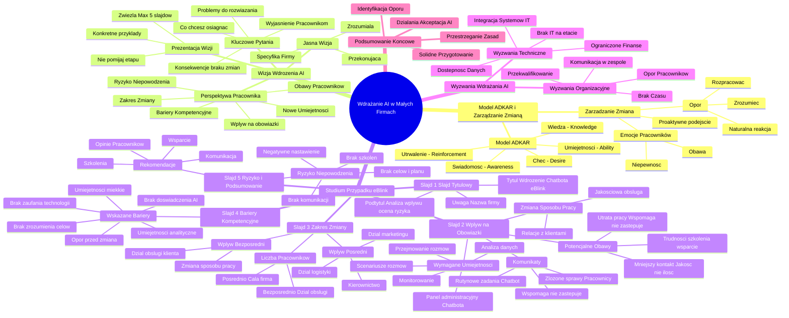

# Lekcje wideo - 2. Planowanie wdrożenia AI – identyfikacja wyzwań i ryzyka

# 💡 Diagram

___

# 🗒️ Notatka

# Notatki i Podsumowanie: Wdrażanie Sztucznej Inteligencji w Małych Firmach 🚀

## Wprowadzenie

Ta lekcja skupia się na wdrażaniu `sztucznej inteligencji` (AI) w małych firmach. Jej celem jest nauczenie, jak identyfikować potencjalne wyzwania i ryzyka związane z tym procesem oraz jak opracowywać plany zaradcze, dostosowane do specyfiki małych przedsiębiorstw.

**Kluczowe przesłanie:** Sukces wdrożenia AI zależy przede wszystkim od **przygotowania i zarządzania zmianą**, a nie tylko od samej technologii.

## Model ADKAR i Zarządzanie Zmianą 🔄

*   **Model ADKAR** – akronim z poprzedniej lekcji, kluczowy dla zrozumienia i zarządzania zmianą:
    *   **A** - Świadomość (`Awareness`) 💡
    *   **D** - Chęć (`Desire`) ❤️
    *   **K** - Wiedza (`Knowledge`) 🧠
    *   **A** - Umiejętności (`Ability`) 💪
    *   **R** - Utrwalenie (`Reinforcement`) 🏆
*   Identyfikacja wyzwań i ryzyka to **proaktywne podejście**, a nie pesymizm. Pomaga unikać problemów i znacząco zwiększa szanse na sukces.
*   **Zmiana wywołuje emocje** u pracowników (niepewność, obawa przed nieznanym). Warto o tym pamiętać.
*   **Opór** jest naturalną reakcją obronną, którą należy zaakceptować, zrozumieć i metodycznie rozpracować. Nie ignoruj oporu, ale staraj się go zrozumieć.

## Wizja Wdrożenia AI 👁️

*   Przed wdrożeniem AI, firma musi posiadać **jasną wizję**, precyzyjnie dostosowaną do swojej specyfiki. Wizja powinna być zrozumiała i przekonująca.
*   **Kluczowe pytania**, które ułatwią sformułowanie wizji:
    *   **Co chcesz osiągnąć dzięki AI?** (obniżenie kosztów 📉, poprawa jakości 📈, nowe możliwości biznesowe 💼)
    *   **Czy potrafisz jasno wytłumaczyć pracownikom, dlaczego to robisz?** Komunikacja jest kluczowa.
    *   **Jakie konkretne problemy w firmie może rozwiązać AI?** (długi czas obsługi klienta 🕰️, powtarzalne zadania 🤖, trudności z pozyskiwaniem klientów 👥)
    *   **Co się stanie, jeśli nie wprowadzimy zmian?** (utrata klientów 💔, pozostanie w tyle za konkurencją 🐌, mniejsza efektywność 📉)
*   Ważne jest zrozumienie zmiany z **perspektywy pracownika**. Empatia jest kluczowa.
    *   Jak wdrożenie AI wpłynie na ich codzienne obowiązki?
    *   Czy będą musieli nabyć nowych umiejętności?
    *   Czego konkretnie mogą się obawiać?
    *   Ilu pracowników i w jakim stopniu dotknie zmiana?
    *   Kogo zmiana dotknie najbardziej bezpośrednio?
    *   Czy dostrzegasz potencjalne bariery kompetencyjne?
    *   Jak realnie szacujesz ryzyko niepowodzenia całego projektu?

## Przygotowanie Prezentacji Wizji 🎤

*   Przygotuj **zwięzłą prezentację (maksymalnie 5 slajdów)**, która odpowie na powyższe pytania. Krótka i treściwa prezentacja jest najbardziej efektywna.
*   Użyj **konkretnych przykładów** bezpośrednio związanych z firmą. Przykłady powinny być zrozumiałe i bliskie pracownikom.
*   **Nie pomijaj tego etapu!** Jest on kluczowy dla sukcesu wdrożenia.

## Studium Przypadku: Wdrożenie Chatbota w \"eBlinku\" (Przykład Prezentacji) 🏢

### Slajd 1: Slajd Tytułowy 🏷️

*   **Tytuł:** Wdrożenie Chatbota w \"eBlinku\": Analiza wpływu na pracowników i ocena ryzyka.
*   **Podtytuł:** Studium przypadku dla zespołu obsługi klienta.
*   **Uwaga:** Zamiast \"eBlink\" możesz wstawić nazwę własnej firmy. Dostosuj przykład do swojej rzeczywistości.

### Slajd 2: Wpływ na Codzienne Obowiązki ⚙️

*   **Tytuł:** Wpływ na codzienne obowiązki. Jak zmieni się praca zespołu?
*   **Komunikaty:**
    *   **Wdrożenie Chatbota ma wspomagać, a nie zastępować** waszą pracę. Kluczowe jest podkreślenie wsparcia, a nie zastąpienia.
    *   Chatbot przejmie obsługę **rutynowych zadań** (status zamówienia, dostępność rozmiarów, informacje o wysyłce). Automatyzacja rutynowych zadań uwolni czas na ważniejsze sprawy.
    *   Wasza rola przesunie się w kierunku obsługi **bardziej złożonych spraw** (nietypowe reklamacje, doradztwo, budowanie relacji z kluczowymi klientami). Skupienie na jakości i relacjach z klientami.
*   **Wymagane nowe umiejętności:**
    *   Obsługa panelu administracyjnego Chatbota.
    *   Dodawanie i modyfikowanie scenariuszy rozmów.
    *   Monitorowanie działania Chatbota.
    *   Efektywne przejmowanie rozmów od Chatbota.
    *   Analiza danych generowanych przez Chatbota.
*   **Potencjalne obawy:**
    *   Obawa przed utratą pracy (**Chatbot ma wspomagać, a nie zastępować**). Ponownie podkreślono rolę wsparcia.
    *   Trudności w nauce obsługi nowego narzędzia (**zapewnimy szkolenia i wsparcie**). Zapewnienie wsparcia i szkoleń rozwiewa obawy.
    *   Zmniejszenie kontaktu z klientami (**możliwość skupienia się na jakości, a nie ilości interakcji**). Przejście na jakość interakcji, a nie tylko ilość.
*   **Zmiana sposobu pracy:**
    *   Przejście od ilościowej do jakościowej obsługi klienta.
    *   Większy nacisk na rozwiązywanie problemów i budowanie relacji z klientami.

### Slajd 3: Zakres Zmiany 🎯

*   **Tytuł:** Zakres zmiany. Kogo dotyczy zmiana?
*   **Wpływ bezpośredni:**
    *   Wszyscy pracownicy działu obsługi klienta (ok. 8-10 osób).
    *   Ich sposób pracy zmieni się w **największym stopniu**. To oni odczują zmianę najbardziej.
*   **Wpływ pośredni:**
    *   Dział marketingu (personalizacja komunikacji na podstawie danych z Chatbota).
    *   Dział logistyki (usprawnienie zwrotów i reklamacji).
    *   Kierownictwo (monitorowanie wyników i wprowadzanie korekt).
*   **Liczba pracowników:**
    *   Wdrożenie **bezpośrednio** dotknie znaczną część zespołu obsługi klienta.
    *   Zmiana wpłynie **pośrednio** na niemal całą firmę. Zmiana ma szerszy zasięg niż tylko dział obsługi klienta.

### Slajd 4: Bariery Kompetencyjne 🚧

*   **Tytuł:** Bariery kompetencyjne. Potencjalne bariery kompetencyjne.
*   **Wskazane bariery:**
    *   **Brak doświadczenia w obsłudze narzędzi AI.** (większość pracowników nie miała wcześniej styczności z Chatbotami).
    *   **Niewystarczające umiejętności analityczne.** (interpretacja danych z Chatbota może stanowić wyzwanie).
    *   **Opór przed zmianą.** (naturalna obawa przed nowością i nieznanym).
    *   **Niedostateczne umiejętności miękkie.** (obsługa złożonych spraw wymaga rozwiniętych umiejętności komunikacyjnych, empatii i rozwiązywania problemów).
    *   **Brak zrozumienia celów wdrożenia.** (brak jasności co do celów może utrudnić efektywne wykorzystanie narzędzia).
    *   **Brak zaufania do technologii.** (**budowanie zaufania poprzez szkolenia i otwartą komunikację**). Zaufanie buduje się poprzez edukację i transparentność.

### Slajd 5: Ryzyko Niepowodzenia i Podsumowanie ⚠️

*   **Tytuł:** Ryzyko niepowodzenia i podsumowanie. Szacowane ryzyko niepowodzenia.
*   **Ryzyko niepowodzenia w eBlinku wynika z:**
    *   Brak jasno zdefiniowanych celów i szczegółowego planu wdrożenia.
    *   Niedostateczna komunikacja i brak zaangażowania pracowników w proces zmiany.
    *   Brak odpowiednich szkoleń i wsparcia dla pracowników.
    *   Negatywne nastawienie pracowników i klientów do nowej technologii.
*   **Rekomendacje (zmniejszenie ryzyka):**
    *   **Jasna i transparentna komunikacja.**
    *   **Kompleksowe i regularne szkolenia.**
    *   **Ciągłe wsparcie na każdym etapie wdrożenia.**
    *   **Otwartość na opinie i sugestie pracowników.** Wsłuchiwanie się w głos pracowników jest kluczowe.

## Wyzwania Wdrażania AI w Małej Firmie 😫

### Wyzwania Techniczne 🛠️

*   **Brak specjalistów IT na etacie.**
    *   Jak zapewnić niezbędne wsparcie techniczne? (konsultant zewnętrzny, przeszkolenie obecnych pracowników) Rozważ różne opcje wsparcia technicznego.
*   **Integracja AI z istniejącymi, prostymi systemami IT.**
    *   Czy wybrane narzędzie AI będzie w pełni kompatybilne z aktualnie używanym oprogramowaniem? Kompatybilność systemów jest kluczowa.
*   **Dostępność i jakość danych.**
    *   Czy firma posiada wystarczającą ilość danych do efektywnego działania AI?
    *   Czy posiadane dane są uporządkowane i odpowiednio przygotowane do wykorzystania? Jakość danych ma bezpośredni wpływ na efektywność AI.
*   **Ograniczone zasoby finansowe.** 💰
    *   Jak znaleźć niedrogie, a jednocześnie skuteczne rozwiązania AI dla małej firmy?
    *   Jak efektywnie sfinansować wdrożenie AI przy ograniczonym budżecie?

### Wyzwania Organizacyjne 🤝

*   **Opór pracowników przed zmianą.**
    *   Jak skutecznie przekonać pracowników, że AI to szansa na rozwój, a nie zagrożenie dla ich stanowisk?
    *   Jak zmotywować zespół do aktywnego udziału w nauce nowych umiejętności? Motywacja i pozytywne nastawienie są kluczowe.
*   **Brak czasu na szkolenia i wdrożenie.** 🕰️
    *   Jak zorganizować pracę, aby umożliwić pracownikom uczestnictwo w niezbędnych szkoleniach?
*   **Komunikacja w małym zespole.** 🗣️
    *   Jak skutecznie informować o postępach wdrożenia i na bieżąco odpowiadać na wszelkie obawy? Otwarta komunikacja w małym zespole jest szczególnie ważna.
*   **Ograniczone możliwości przekwalifikowania pracowników.**
    *   Co zrobić w sytuacji, gdy niektórzy pracownicy nie będą w stanie przystosować się do nowych wymagań? Plan B na wypadek trudności z adaptacją.

## Podsumowanie Końcowe 📝

*   **Kluczowe jest solidne przygotowanie się do wdrożenia AI.** Dobre przygotowanie to podstawa sukcesu.
*   **Identyfikacja przewidywanych punktów oporu w organizacji.** Proaktywne podejście do potencjalnych problemów.
*   **Opracowanie konkretnych działań ułatwiających akceptację i wdrożenie AI.** Plan działania to niezbędny element.
*   Przestrzeganie zasad skutecznego wdrożenia AI pozwoli uniknąć wielu problemów i zwiększyć szanse na sukces.

---

**Podsumowanie:**

Lekcja koncentruje się na kluczowych aspektach wdrażania `sztucznej inteligencji` w małych firmach, podkreślając, że sukces zależy nie tylko od samej technologii, ale przede wszystkim od efektywnego zarządzania zmianą i starannego przygotowania. Omówiono `model ADKAR` jako praktyczne narzędzie do zarządzania procesem zmiany, podkreślono znaczenie jasnej wizji wdrożenia AI oraz uwzględnienie perspektywy pracowników w całym procesie. Przedstawiono studium przypadku wdrożenia Chatbota w fikcyjnej firmie \"eBlink\" (jako praktyczny szablon dla innych firm), ilustrujące analizę wpływu wdrożenia Chatbota na pracowników i szczegółową ocenę ryzyka. Na koniec, zidentyfikowano kluczowe wyzwania techniczne i organizacyjne, które mogą napotkać małe firmy wdrażające AI, akcentując konieczność proaktywnego podejścia i przygotowania na potencjalne trudności.

___

# 🔉 Transcript
File: Lekcje wideo - 2. Planowanie wdrożenia AI – identyfikacja wyzwań i ryzyka.mp4 
[00:00:00] Ekran: Białe tło z pionową czarną kreską po lewej stronie.
[00:00:05] Ekran: Czarny napis "Umiejętności" nad napisem "Jutra". Po prawej stronie logo "AI" w kolorach fioletu i błękitu. Poniżej napisy "Organizator: Google" i "Partner edukacyjny: SGH".
[00:00:05] Witam na kolejnej lekcji poświęconej wdrażaniu sztucznej inteligencji w waszych firmach.
[00:00:11] Celem lekcji jest nauczenie was identyfikowania potencjalnych wyzwań i ryzyka związanych z wdrożeniem AI w waszych firmach oraz opracowywania konkretnych planów zaradczych dostosowanych do realiów małych przedsiębiorstw.
[00:00:26] Proszę pamiętać, że sukces wdrożenia AI zależy od przygotowania i zarządzania zmianą, a nie tylko od technologii.
[00:00:34] Warto tu wspomnieć model ADKAR z poprzedniej lekcji.
[00:00:38] ADKAR to akronim opisujący kolejne kroki przejścia ludzi przez zmiany: świadomość, chęć, wiedza, umiejętności, utrwalenie, a wykorzystanie jego mechanizmu jest kluczowe dla zrozumienia i zarządzania zmianą.
[00:00:52] Należy też podkreślić, że identyfikacja wyzwań i ryzyka to nie pesymizm, ale proaktywne podejście, które pozwala uniknąć problemów i zwiększa szansę na sukces.
[00:01:05] Jeszcze jedna bardzo istotna kwestia.
[00:01:07] Dla większości pracowników każda zmiana wywołuje emocje.
[00:01:12] Takie jak niepewność, obawa przed nieznanym.
[00:01:15] Naturalną reakcją obronną ludzi jest opór, który trzeba zaakceptować, zrozumieć i metodycznie rozpracować.
[00:01:24] Jak już to wcześniej wspominaliśmy, przystępując do wdrożenia AI, musimy posiadać jasną wizję wdrożenia sztucznej inteligencji, dostosowaną do specyfiki firmy.
[00:01:35] Przypomnijmy jeszcze raz kluczowe pytania ułatwiające sformułowanie wizji.
[00:01:41] Czy wiesz, co chcesz osiągnąć dzięki AI?
[00:01:44] Czy to ma być obniżenie kosztów, poprawa jakości, a może stworzenie nowych możliwości biznesowych?
[00:01:52] Czy potrafisz wytłumaczyć swoim pracownikom i współpracownikom, dlaczego to robisz?
[00:01:58] Jakie konkretne problemy w firmie może rozwiązać AI?
[00:02:02] Czy to na przykład zbyt długi czas obsługi klienta, powtarzalne zadania, które zabierają cenny czas, czy trudności z pozyskiwaniem nowych klientów?
[00:02:13] Co się stanie, jeśli nie wprowadzimy zmian?
[00:02:16] Czy stracimy klientów?
[00:02:18] Zostaniemy w tyle za konkurencją?
[00:02:21] A może po prostu będziemy pracować mniej efektywnie, niż moglibyśmy?
[00:02:27] Ważne jest też zrozumienie zmiany z perspektywy pracownika.
[00:02:32] Jak wdrożenie AI wpłynie na ich codzienne obowiązki?
[00:02:36] Czy będą musieli nauczyć się nowych umiejętności, zmienić sposób pracy, czego mogą się obawiać?
[00:02:43] Czy wiesz ilu pracowników i w jakim stopniu musi zmienić swój dotychczasowy sposób pracy?
[00:02:50] Czy możesz jednoznacznie określić, kogo zmiana dotknie w największym stopniu?
[00:02:55] Czy widzisz potencjalne kompetencyjne bariery wdrożenia narzędzi AI?
[00:03:01] Jak szacujesz ryzyko niepowodzenia?
[00:03:04] Aby właściwie przygotować się do komunikacji wizji, spróbuj przygotować krótką prezentację, maksimum na pięć slajdów, w której odpowiesz na powyższe pytania.
[00:03:16] Użyj konkretnych przykładów z twojej firmy.
[00:03:19] Pamiętaj, aby nie zaniechać tego etapu pracy.
[00:03:23] Ekran: Po lewej stronie dr hab. Sylwester Gregorczyk. Po prawej stronie slajd z napisem "Wdrożenie Chatbota w "eBlinku": Analiza wpływu na pracowników i ocena ryzyka. Studium przypadku dla zespołu obsługi klienta". Poniżej napis "Wdrożenie Chatbota w "eBlinku": Wpływ na pracowników i ryzyko".
[00:03:24] Spójrzcie, jak może wyglądać taka prezentacja na przykładzie firmy eBlink, który omawialiśmy wspólnie na poprzedniej lekcji.
[00:03:33] Tworzymy prezentację dla firmy eBlink.
[00:03:36] W miejscu eBlink możesz wstawić nazwę swojej firmy.
[00:03:40] Pierwszy slajd to slajd tytułowy.
[00:03:43] Nasz tytuł to wdrożenie Chatbota w eBlinku.
[00:03:46] Analiza wpływu na pracowników i ocena ryzyka.
[00:03:51] Dodajemy też podtytuł: Studium przypadku dla zespołu obsługi klienta.
[00:03:56] Ekran: Po lewej stronie dr hab. Sylwester Gregorczyk. Po prawej stronie slajd z napisem "Wpływ na codzienne obowiązki. Jak zmieni się praca zespołu?". Poniżej wypunktowane informacje.
[00:03:56] Teraz drugi slajd.
[00:03:57] Zatytułujemy go wpływ na codzienne obowiązki.
[00:04:02] Dodajemy nagłówek: Jak zmieni się praca zespołu?
[00:04:06] I umieszczamy przykładowe komunikaty.
[00:04:09] Proszę zwrócić uwagę na wyróżnione słowa.
[00:04:12] Wdrożenie Chatbota wspomaga, a nie zastępuje waszą pracę.
[00:04:18] Chatbot przejmie obsługę rutynowych zadań, na przykład status zamówienia, dostępność rozmiarów, informacje o wysyłce.
[00:04:27] Wasza rola przesunie się w kierunku obsługi bardziej złożonych spraw, wymagających indywidualnego podejścia, empatii i kreatywności, na przykład nietypowe reklamacje, doradztwo w doborze produktów, budowanie relacji z kluczowymi klientami.
[00:04:40] Wymagane nowe umiejętności.
[00:04:43] Obsługa panelu administracyjnego Chatbota, dodawanie i modyfikowanie scenariuszy rozmów, monitorowanie działania.
[00:04:50] Efektywne przejmowanie rozmów od Chatbota.
[00:04:53] Analiza danych z Chatbota w celu identyfikacji obszarów do poprawy.
[00:04:57] Potencjalne obawy.
[00:05:00] Utrata pracy, niesłuszna, Chatbot ma wspomagać, a nie zastępować.
[00:05:05] Trudności w nauce obsługi nowego narzędzia zapewnimy kompleksowe szkolenia i wsparcie.
[00:05:11] Zmniejszenie kontaktu z klientami, możliwość skupienia się na jakości, a nie ilości interakcji.
[00:05:16] Zmiana sposobu pracy.
[00:05:19] Przejście od ilościowej do jakościowej obsługi klienta.
[00:05:22] Większy nacisk na rozwiązywanie problemów i budowanie relacji.
[00:05:43] Ekran: Po lewej stronie dr hab. Sylwester Gregorczyk. Po prawej stronie slajd z napisem "Zakres zmiany. Kogo dotyczy zmiana?". Poniżej wypunktowane informacje.
[00:05:44] Teraz slajd trzeci.
[00:05:46] Zatytułujemy zakres zmiany i dodamy nagłówek: kogo dotyczy zmiana?
[00:05:53] Warto wskazać, na kogo zmiana będzie miała bezpośredni wpływ.
[00:05:58] Wszyscy pracownicy działu obsługi klienta, to jest około 8 do 10 osób.
[00:06:04] Ich dotychczasowy sposób pracy zmieni się w największym stopniu.
[00:06:08] Będzie też pośredni wpływ.
[00:06:11] Na pracowników działu marketingu, potencjalne wykorzystanie danych z Chatbota do personalizacji komunikacji.
[00:06:17] Pracownicy działu logistyki, potencjalne usprawnienie procesu zwrotów i reklamacji.
[00:06:23] Kierownictwo, konieczność monitorowania wyników i wprowadzania ewentualnych korekt.
[00:06:29] Liczba pracowników.
[00:06:31] Wdrożenie bezpośrednio dotknie znaczną część zespołu obsługi klienta.
[00:06:36] Zmiana wpłynie pośrednio na niemal całą firmę.
[00:06:42] Ekran: Po lewej stronie dr hab. Sylwester Gregorczyk. Po prawej stronie slajd z napisem "Kompetencyjne bariery. Potencjalne bariery kompetencyjne". Poniżej wypunktowane informacje.
[00:06:43] Slajd czwarty zatytułujemy kompetencyjne bariery i dodamy nagłówek potencjalne bariery kompetencyjne.
[00:06:53] Wskazane bariery będą wynikały z naszej wcześniejszej analizy.
[00:06:57] Możemy tu wyróżnić na przykład brak doświadczenia w obsłudze narzędzi AI.
[00:07:03] Większość pracowników obsługi klienta prawdopodobnie nie miała wcześniej do czynienia z Chatbotem.
[00:07:09] Ponadto mają niewystarczające umiejętności analityczne.
[00:07:13] Interpretacja danych z Chatbota i wyciąganie wniosków może być wyzwaniem.
[00:07:18] Opór przed zmianą.
[00:07:20] Naturalna obawa przed nowym i nieznanym, szczególnie w sytuacji braku wcześniejszej komunikacji i zaangażowania.
[00:07:27] Niedostateczne umiejętności miękkie.
[00:07:31] Obsługa bardziej złożonych spraw będzie wymagała rozwiniętych umiejętności komunikacyjnych, empatii i rozwiązywania problemów.
[00:07:39] Brak zrozumienia celów wdrożenia.
[00:07:42] Jeśli pracownicy nie rozumieją, dlaczego wprowadzana jest zmiana, nie będą w stanie efektywnie wykorzystać nowego narzędzia.
[00:07:50] Możliwy jest brak zaufania do technologii.
[00:07:53] Trzeba budować zaufanie poprzez szkolenia i komunikację.
[00:08:05] Ekran: Po lewej stronie dr hab. Sylwester Gregorczyk. Po prawej stronie slajd z napisem "Ryzyko niepowodzenia i podsumowanie. Szacowane ryzyko niepowodzenia". Poniżej wypunktowane informacje.
[00:08:06] Ostatni slajd piąty będzie miał tytuł ryzyko niepowodzenia i podsumowanie.
[00:08:13] Dodajmy też nagłówek: szacowane ryzyko niepowodzenia.
[00:08:17] W treści wskazujemy zidentyfikowane ryzyko i sposób radzenia sobie z nim.
[00:08:23] Na ryzyko niepowodzenia w eBlink wpływają: brak jasno zdefiniowanych celów i planu wdrożenia.
[00:08:29] Brak komunikacji i zaangażowania pracowników.
[00:08:32] Brak szkoleń i wsparcia.
[00:08:34] Negatywne nastawienie pracowników i klientów.
[00:08:38] Rekomendacja: ryzyko będzie mniejsze, jeśli wprowadzone zostaną: jasna komunikacja, kompleksowe szkolenia, ciągłe wsparcie, otwartość na opinie i sugestie pracowników.
[00:09:06] Ekran: Po lewej stronie dr hab. Sylwester Gregorczyk. Po prawej stronie slajd z napisem "Wdrażanie AI w małej firmie. Wyzwania techniczne". Poniżej wypunktowane informacje.
[00:09:06] Aby ułatwić ci ten krok, podsumowuję kilka propozycji w podziale na wyzwania techniczne, organizacyjne i ryzyko biznesowe.
[00:09:16] Jakie są wyzwania techniczne specyficzne dla małych firm?
[00:09:19] To na pewno brak specjalistów IT na etacie.
[00:09:22] Tu trzeba sobie odpowiedzieć na takie pytania: jak zapewnić wsparcie techniczne?
[00:09:26] Czy zatrudnić zewnętrznego konsultanta, czy przeszkolić obecnych pracowników?
[00:09:30] Kolejne wyzwanie to integracja AI z prostymi systemami IT w firmie.
[00:09:36] Czy wybrane narzędzie AI będzie kompatybilne z używanym oprogramowaniem?
[00:09:41] Nie bez znaczenia jest też dostępność i jakość danych w małej firmie.
[00:09:46] Czy mamy wystarczająco dużo danych, aby AI mogła się nauczyć działać?
[00:09:50] Czy dane są uporządkowane i czyste?
[00:09:53] I jeszcze jedno istotne wyzwanie: ograniczone zasoby finansowe.
[00:09:58] Jak znaleźć niedrogie, ale skuteczne rozwiązania AI?
[00:10:02] Jak sfinansować wdrożenie?
[00:10:38] Ekran: Po lewej stronie dr hab. Sylwester Gregorczyk. Po prawej stronie slajd z napisem "Wdrażanie AI w małej firmie. Wyzwania organizacyjne". Poniżej wypunktowane informacje.
[00:10:38] Drugą grupę wyzwań stanowią organizacyjne, te związane z ludźmi.
[00:10:45] Z pewnością pojawi się opór pracowników przed zmianą.
[00:10:49] Jak przekonać pracowników, że AI to szansa, a nie zagrożenie?
[00:10:52] Jak zmotywować ich do nauki nowych umiejętności?
[00:10:57] Brak czasu na szkolenia i wdrożenie.
[00:11:00] Jak zorganizować pracę, aby pracownicy mogli uczestniczyć w szkoleniach i wdrażać nowe narzędzia?
[00:11:05] Komunikacja w małym zespole.
[00:11:07] Jak skutecznie informować o postępach we wdrożeniu i odpowiadać na pytania i obawy pracowników?
[00:11:15] Ograniczone możliwości przekwalifikowania pracowników.
[00:11:19] Co zrobić, jeśli niektórzy pracownicy nie będą w stanie przystosować się do nowych warunków?
[00:11:27] Należy pamiętać, że wdrożenie narzędzia AI w firmie podlega określonym zasadom, których przestrzeganie pozwoli uniknąć bolesnych i nieprzyjemnych niespodzianek.
[00:11:37] Kluczowe jest przygotowanie się do wdrożenia, identyfikacja przewidywanych punktów oporu i opracowanie działań ułatwiających przyjęcie AI.
[00:17:04] Ekran: Białe tło z pionową czarną kreską po lewej stronie.
[00:17:04] Ekran: Czarny napis "Umiejętności" nad napisem "Jutra". Po prawej stronie logo "AI" w kolorach fioletu i błękitu. Poniżej napisy "Organizator: Google" i "Partner edukacyjny: SGH".

___
# 🏷️ Tags
#sztuczna_inteligencja #AI #małe_firmy #wdrażanie_AI #wyzwania #ryzyka #plany_zaradcze #małe_przedsiębiorstwa #przygotowanie #zarządzanie_zmianą #technologia #model_ADKAR #świadomość #chęć #wiedza #umiejętności #utrwalenie #proaktywne_podejście #emocje #pracownicy #niepewność #obawa_przed_nieznanym #opór #wizja_wdrożenia_AI #komunikacja #problemy_firmy #efektywność #perspektywa_pracownika #obowiązki #umiejętności #bariery_kompetencyjne #ryzyko_niepowodzenia #prezentacja #slajd_tytułowy #studium_przypadku #eBlink #zespół_obsługi_klienta #wpływ_na_obowiązki #rutynowe_zadania #automatyzacja #złożone_sprawy #reklamacje #doradztwo #relacje_z_klientami #panel_administracyjny_Chatbota #scenariusze_rozmów #monitorowanie_działania_Chatbota #analiza_danych #szkolenia #wsparcie #jakość_interakcji #zakres_zmiany #dział_marketingu #personalizacja_komunikacji #dział_logistyki #usprawnienie_zwrotów #kierownictwo #wyniki #korekty #brak_doświadczenia_w_obsłudze_AI #umiejętności_analityczne #brak_zrozumienia_celów #zaufanie_do_technologii #cele_wdrożenia #plan_wdrożenia #nastawienie_pracowników #nastawienie_klientów #rekomendacje #opinie_pracowników #sugestie_pracowników #wyzwania_techniczne #brak_specjalistów_IT #wsparcie_techniczne #konsultant_zewnętrzny #przeszkolenie_pracowników #integracja_AI #kompatybilność_systemów #dostępność_danych #jakość_danych #zasoby_finansowe #niedrogie_rozwiązania_AI #budżet #wyzwania_organizacyjne #szansa_na_rozwój #motywacja #brak_czasu_na_szkolenia #komunikacja_w_zespole #przekwalifikowanie_pracowników #plan_B #solidne_przygotowanie #punkty_oporu #działania_ułatwiające_akceptację #zasady_wdrożenia_AI #sukces #Chatbot
