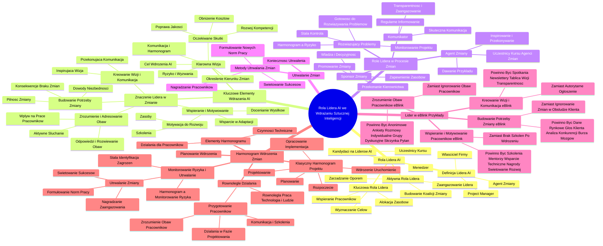

# Lekcje wideo - 3. Lider AI w akcji – komunikacja, prowadzenie i utrwalanie zmian

# 💡 Diagram

___

# 🗒️ Notatka

# Umiejętności AI Jutra: Rola Lidera AI we Wdrażaniu Sztucznej Inteligencji - Notatki i Podsumowanie

## Wprowadzenie

Niniejsze notatki stanowią podsumowanie lekcji z kursu "Umiejętności AI Jutra", która koncentruje się na roli lidera w procesie wdrażania `sztucznej inteligencji` (AI) w przedsiębiorstwach. Celem lekcji jest wyposażenie uczestników w praktyczne narzędzia i strategie, które umożliwią im skuteczne komunikowanie wizji AI, przeprowadzenie pracowników przez proces zmian oraz utrwalenie nowych standardów opartych na AI. W tym kontekście, **lider AI** odgrywa kluczową rolę.

## Rola Lidera AI we Wdrażaniu Zmian

### Kim jest Lider AI?

- **Definicja Lidera AI**:
    - Może to być właściciel firmy, menedżer, kierownik projektu (Project Manager), czy agent zmiany.
- **Kluczowa Rola**: Wyznaczanie celów, alokacja zasobów i wspieranie pracowników w procesie adaptacji do AI.
- **Kandydaci na Liderów AI**: Uczestnicy kursu, przygotowani do wykorzystania AI w biznesie, są naturalnymi kandydatami na **liderów AI**.

### Aktywna Rola Lidera

- **Zaangażowanie Lidera**: Lider musi aktywnie uczestniczyć w procesie wdrażania AI.
- **Budowanie Koalicji Zmiany**: Stworzenie **koalicji na rzecz zmiany** jest niezbędne dla powodzenia wdrożenia.
- **Zarządzanie Oporem**: Skuteczne zarządzanie **oporem** pracowników wobec zmian.

### Kluczowe Elementy Skutecznego Wdrażania AI

1. **Klarowna Wizja**:
    - **Określenie Kierunku**: Jasne zdefiniowanie kierunku zmian i korzyści, jakie AI przyniesie organizacji.
    - **Cel Wdrożenia**: Precyzyjne określenie, jakie narzędzie AI zostanie wdrożone i w jakim konkretnie celu.
    - **Oczekiwane Skutki**:  Zidentyfikowanie oczekiwanych efektów wdrożenia, takich jak obniżenie kosztów 📉, poprawa jakości 📈, rozwój kompetencji 🧠?
    - **Komunikacja i Harmonogram**:  Ustalenie sposobu komunikacji zmian oraz szczegółowy harmonogram spotkań 📅.
    - **Ryzyko i Wyzwania**: Odniesienie do materiałów z lekcji dotyczących wyzwań i ryzyk związanych z wdrożeniami.

2. **Znaczenie Lidera w Procesie Wprowadzania Zmian**:
    - **Kreowanie Wizji i Komunikacja**:
        - **Inspirująca Wizja**: Stworzenie jasnej i porywającej wizji wykorzystania AI w organizacji.
        - **Przekonująca Komunikacja**: Skuteczne komunikowanie wizji, z naciskiem na korzyści dla firmy i każdego pracownika.
    - **Budowanie Poczucia Potrzeby Zmiany**:
        - **Pilność Zmiany**: Wytworzenie poczucia pilności i konieczności wprowadzenia zmian.
        - **Dowody na Niezbędność**:  Przedstawienie argumentów i dowodów na niezbędność wdrożenia AI dla przyszłości firmy.
        - **Konsekwencje Braku Zmian**: Uświadomienie pracownikom korzyści płynących ze zmian oraz potencjalnych negatywnych konsekwencji braku adaptacji.
    - **Zrozumienie i Adresowanie Obaw Pracowników**:
        - **Aktywne Słuchanie**:  Aktywne słuchanie obaw i wątpliwości pracowników dotyczących wdrożenia AI.
        - **Wpływ na Pracę**: Zrozumienie, jak zmiana wpłynie na codzienne obowiązki i wymagane kompetencje pracowników.
        - **Odpowiedzi i Rozwiewanie Obaw**:  Udzielanie wyczerpujących odpowiedzi na pytania i aktywne rozwiewanie obaw.
    - **Wspieranie i Motywowanie Pracowników**:
        - **Wsparcie w Adaptacji**:  Zapewnienie wsparcia pracownikom w adaptacji do nowych technologii i metod pracy.
        - **Motywacja do Rozwoju**: Motywowanie do ciągłej nauki i rozwoju kompetencji (oferowanie szkoleń 🧑‍🏫, udostępnianie zasobów).
        - **Docenianie Wysiłków**: Docenianie i nagradzanie wysiłków włożonych w proces adaptacji do zmian.

### Role Lidera w Procesie Wprowadzania Zmian

- **Sponsor Zmiany**:
    - **Zapewnienie Zasobów**:  Gwarantowanie dostępności zasobów i wsparcia niezbędnego dla projektu wdrożenia AI.
    - **Promowanie Zmiany**: Aktywne promowanie zmiany w organizacji i usuwanie potencjalnych przeszkód.
    - **Władza i Decyzyjność**:  Rola przeznaczona dla osoby posiadającej realną władzę w organizacji (np. dyrektor generalny).
    - **Przekonanie Kierownictwa**: Kluczowe jest przekonanie wyższego kierownictwa do konieczności i korzyści płynących ze zmian.
- **Agent Zmiany**:
    - **Inspirowanie i Przekonywanie**:  Inspirowanie i przekonywanie pracowników do akceptacji i aktywnego udziału we wdrożeniu AI.
    - **Dawanie Przykładu**:  Prezentowanie korzyści poprzez własny przykład i demonstrację.
    - **Uczestnicy Kursu jako Agenci Zmian**:  Uczestnicy kursu, dzięki zdobytym umiejętnościom, stają się naturalnymi **agentami zmian** w swoich organizacjach.
- **Komunikator**:
    - **Skuteczna Komunikacja**:  Zapewnienie skutecznej i transparentnej komunikacji na temat wdrożenia AI.
    - **Regularne Informowanie**:  Regularne informowanie pracowników o postępach, celach i korzyściach płynących z wdrożenia.
    - **Transparentność i Zaangażowanie**:  Komunikacja powinna być transparentna i angażująca, budująca zaufanie i poczucie współodpowiedzialności.
- **Rozwiązujący Problemy**:
    - **Gotowość do Rozwiązywania Problemów**:  Lider musi być gotowy do szybkiego i efektywnego rozwiązywania problemów i konfliktów pojawiających się w procesie wdrożenia.
    - **Monitorowanie Projektu**:  Aktywne monitorowanie przebiegu projektu wdrożenia i identyfikacja potencjalnych ryzyk.
    - **Harmonogram a Ryzyko**:  Stworzenie harmonogramu ułatwia monitorowanie ryzyka i postępów.
    - **Stała Kontrola**:  Ciągłe monitorowanie i identyfikacja potencjalnych zagrożeń (odchylenia od planów).

## Utrwalanie Zmian

- **Konieczność Utrwalenia**:  Aby zmiana stała się trwała i weszła w krew organizacji, musi zostać skutecznie utrwalona.
- **Metody Utrwalania Zmian**:
    - **Świętowanie Sukcesów** 🎉.
    - **Nagradzanie Wyróżniających się Pracowników** 🏆.
    - **Formułowanie Nowych Norm Pracy**.

## Lider w eBlink - Przykłady "Zamiast - Powinno być"

Przykłady dobrych praktyk dla lidera w kontekście wdrożenia AI (np. chatbota 🤖) w firmie eBlink:

1. **Kreowanie Wizji i Komunikacja**:
    - **Zamiast**: Autorytarne ogłoszenie o wdrożeniu chatbota bez szczegółowych wyjaśnień.
    - **Powinno być**:
        - Organizacja spotkań informacyjnych ze wszystkimi pracownikami.
        - Regularne newslettery/e-maile informujące o postępach i korzyściach.
        - Stworzenie tablicy wizji, prezentującej cele i kierunek zmian.
        - Zapewnienie pełnej transparentności procesu wdrożenia.

2. **Budowanie Poczucia Potrzeby Zmiany**:
    - **Zamiast**: Ignorowanie zachodzących zmian w sposobie obsługi klienta w branży.
    - **Powinno być**:
        - Prezentacja danych rynkowych i analiz branżowych.
        - Regularne zbieranie i prezentowanie "głosu klienta".
        - Analiza działań konkurencji i ich strategii w zakresie AI.
        - Organizacja warsztatów "Burza mózgów" z pracownikami w celu wygenerowania pomysłów i zrozumienia potrzeb.

3. **Zrozumienie i Adresowanie Obaw Pracowników**:
    - **Zamiast**: Ignorowanie obaw pracowników i postawienie ich przed faktem dokonanym.
    - **Powinno być**:
        - Przeprowadzenie anonimowych ankiet w celu zebrania opinii i obaw.
        - Organizacja indywidualnych rozmów z pracownikami.
        - Utworzenie grup dyskusyjnych, umożliwiających otwartą wymianę myśli.
        - Uruchomienie "skrzynki pytań i odpowiedzi", zapewniającej platformę do zadawania pytań i uzyskiwania odpowiedzi.

4. **Wspieranie i Motywowanie Pracowników**:
    - **Zamiast**: Brak szkoleń i wsparcia dla pracowników po wdrożeniu chatbota.
    - **Powinno być**:
        - Zapewnienie kompleksowych szkoleń z obsługi nowego narzędzia AI.
        - Utworzenie systemu mentorów, wspierających pracowników w adaptacji.
        - Dostęp do wsparcia technicznego na każdym etapie wdrożenia.
        - Wprowadzenie systemu nagród i wyróżnień za zaangażowanie w proces zmian.
        - Świętowanie osiągniętych sukcesów.
        - Stworzenie możliwości rozwoju kompetencji w obszarze AI.

## Harmonogram Wdrożenia Zmian

- **Planowanie Wdrożenia**:  Skuteczne wdrożenie zmiany wymaga szczegółowego planowania i organizacji.
- **Harmonogram Wdrożenia**:  Konieczność stworzenia **harmonogramu wdrożenia**, czyli uporządkowanego planu działań rozłożonego w czasie.
- **Elementy Harmonogramu**: Harmonogram powinien uwzględniać:
    - Czynności techniczne bezpośrednio związane z wdrożeniem technologii AI.
    - Działania skoncentrowane na przeprowadzeniu pracowników przez proces zmian.

### Klasyczny Harmonogram Projektu

1. **Rozpoczęcie**:
    - Podjęcie decyzji o wdrożeniu AI.
    - Powołanie zespołu odpowiedzialnego za wdrożenie.
    - Ustalenie mierzalnych celów wdrożenia.
2. **Planowanie**:
    - Szczegółowe określenie czynności niezbędnych do osiągnięcia wyznaczonych celów.
3. **Projektowanie**:
    - Opracowanie szczegółowych rozwiązań technicznych i organizacyjnych.
4. **Opracowanie/Implementacja**.
5. **Wdrożenie/Uruchomienie**.

### Równoległe Działania

- **Przygotowanie Pracowników**: Równolegle z rozpoczęciem projektu, należy uruchomić działania przygotowujące pracowników do nadchodzącej zmiany:
    - Zidentyfikowanie i zrozumienie obaw pracowników.
    - Zaplanowanie strategii komunikacji, szkoleń i działań mających na celu przeciwdziałanie oporowi.
    - Wdrożenie działań przygotowawczych już w fazie projektowania.
- **Równoległa Praca**:  Kluczowe jest prowadzenie równoległych działań – praca nad technologią i jednoczesne przygotowanie ludzi do pełnego wdrożenia.

### Monitorowanie Ryzyka i Utrwalanie Zmian

- **Harmonogram a Monitorowanie Ryzyka**: Harmonogram wdrożenia ułatwia monitorowanie potencjalnych ryzyk (odchylenia od założonego planu).
- **Stała Identyfikacja Zagrożeń**:  Konieczność stałego monitorowania i identyfikacji pojawiających się zagrożeń.
- **Utrwalanie Zmiany poprzez**:
    - Świętowanie osiągniętych sukcesów.
    - Nagradzanie zaangażowania i wysiłków.
    - Formułowanie i wdrażanie nowych norm pracy, uwzględniających AI.

## Podsumowanie

Lekcja podkreśla fundamentalną rolę **lidera AI** w skutecznym wdrażaniu `sztucznej inteligencji` w organizacjach. **Lider AI** musi aktywnie kreować jasną wizję przyszłości, budować poczucie pilnej potrzeby zmiany, z empatią adresować obawy pracowników i oferować im aktywne wsparcie w procesie adaptacji. Istotne jest również, aby lider sprawnie pełnił różnorodne role – sponsora, agenta zmiany, komunikatora i osoby skutecznie rozwiązującej problemy. Efektywne wdrożenie AI wymaga precyzyjnego planowania, uwzględniającego zarówno aspekty techniczne, jak i ludzkie, oraz konsekwentnego utrwalania zmian, aby stały się one integralną częścią kultury organizacyjnej. Uczestnicy kursu "Umiejętności AI Jutra" są idealnymi kandydatami na **liderów AI**, posiadającymi niezbędne kompetencje do skutecznego przeprowadzenia tych transformacyjnych zmian w swoich firmach.

___

# 🔉 Transcript
File: Lekcje wideo - 3. Lider AI w akcji – komunikacja, prowadzenie i utrwalanie zmian.mp4 
[00:00:00] Ekran: Białe tło z pionową czarną kreską po lewej stronie.
[00:00:01] Ekran: Napis "Umiejętności Jutra" w kolorze czarnym.
[00:00:02] Ekran: Napis "Umiejętności AI Jutra" w kolorze czarnym i gradientowym.
[00:00:03] Ekran: Napis "Umiejętności AI Jutra" w kolorze czarnym i gradientowym. Dodatkowo, na dole ekranu, po lewej stronie napis "Organizator: Google", a po prawej "Partner edukacyjny: SGH".
[00:00:05] Ekran: Mężczyzna w garniturze siedzi za biurkiem. W tle drewniana ściana, roślina, laptop i inne przedmioty. Na dole ekranu napis "dr hab. Sylwester Gregorczyk, Szkoła Główna Handlowa w Warszawie".
[00:00:05] Witam na kolejnej lekcji poświęconej wdrażaniu sztucznej inteligencji w waszych firmach.
[00:00:10] Celem lekcji jest wyposażenie was w praktyczne narzędzia i strategie niezbędne do skutecznego komunikowania wizji AI, przeprowadzania pracowników przez proces zmiany oraz utrwalania nowych standardów opartych na AI.
[00:00:25] W tej lekcji mocno skupimy się na roli lidera AI jako kluczowego czynnika sukcesu we wdrażaniu innowacji technologicznych w organizacji.
[00:00:35] Na koniec omówimy konkretne metody utrwalania zmian w celu zachowania planowanych wskaźników efektywności.
[00:00:43] Należy zaznaczyć, że lider AI, może to być właściciel, menedżer, project manager, agent zmiany, odgrywa kluczową rolę w procesie wdrażania sztucznej inteligencji, wyznaczając cele, zapewniając zasoby i wspierając pracowników w procesie adaptacji.
[00:01:01] Wy jako uczestnicy tego kursu, przygotowani do wykorzystywania narzędzi AI w biznesie, jesteście naturalnie predystynowani do pełnienia roli lidera AI w swoich firmach.
[00:01:14] Lider musi brać aktywny udział w procesie wdrażania AI, musi budować koalicję na rzecz zmiany i zarządzać oporem, który na pewno się pojawi.
[00:01:25] Może wydawać się nudne moje ciągłe powtarzanie tego samego, ale jeszcze raz muszę podkreślić, że każda zmiana zaczyna się od sformułowania klarownej wizji określającej kierunek planowanych zmian i korzyści jakie AI ma przynieść organizacji.
[00:01:43] Aby to zrobić w swoich firmach, musicie określić jakie narzędzie AI chcecie wdrożyć i do czego ma ono służyć.
[00:01:51] Jaki będzie skutek tego wdrożenia?
[00:01:53] Czy to obniżenie kosztów, poprawa jakości, a może budowa nowych kompetencji?
[00:01:59] I w jaki sposób zakomunikujecie zmiany?
[00:02:02] Kiedy odbędą się spotkania i jaka będzie treść przekazywanych komunikatów?
[00:02:07] Aby to dobrze przygotować, sięgnijcie proszę do materiałów omawianych na lekcji dotyczącej wyzwań i ryzyk wdrożeniowych.
[00:02:15] Przygotujcie odpowiedzi na powyższe pytania dla jednej wybranej technologii AI, którą chcecie wdrożyć u siebie w organizacji.
[00:02:23] To pomoże wam lepiej zrozumieć rolę lidera w procesie wdrażania AI.
[00:02:28] Jakie znaczenie ma lider w procesie wprowadzania zmian?
[00:02:31] Ekran: Mężczyzna w garniturze siedzi za biurkiem. W tle drewniana ściana, roślina, laptop i inne przedmioty. Po prawej stronie ekranu napis "Lider w procesie zmiany, Znaczenie lidera w procesie wprowadzania zmian". Poniżej wypunktowane: "Kreowanie wizji i komunikacja, Budowanie poczucia potrzeby zmiany, Zrozumienie i adresowanie obaw pracowników, Wspieranie i motywowanie pracowników".
[00:02:32] Po pierwsze, ma za zadanie wykreować wizję i skutecznie ją komunikować.
[00:02:38] Lider jest odpowiedzialny za stworzenie jasnej i porywającej wizji wykorzystania AI w firmie, która będzie zrozumiała i akceptowalna przez wszystkich pracowników.
[00:02:48] Musi komunikować tę wizję w sposób przekonujący, wyjaśniając korzyści dla firmy i poszczególnych pracowników.
[00:02:57] Po drugie, lider buduje poczucie potrzeby zmiany.
[00:03:00] Lider musi wytworzyć wśród pracowników poczucie pilności zmiany, pokazując konkretne dowody na to dlaczego wdrożenie AI jest niezbędne dla przyszłości firmy.
[00:03:10] Powinien przedstawić korzyści jakie przyniesie wdrożenie AI oraz konsekwencje braku zmian.
[00:03:18] Lider musi zrozumieć i odpowiednio zaadresować obawy pracowników.
[00:03:23] Lider powinien aktywnie słuchać obaw i wątpliwości pracowników związanych z wdrożeniem AI.
[00:03:29] Musi zrozumieć jak zmiana wpłynie na ich pracę i jakie kompetencje będą musieli nabyć.
[00:03:37] Ważne jest, aby lider potrafił odpowiedzieć na pytania pracowników i rozwiać ich obawy.
[00:03:43] Ekran: Mężczyzna w garniturze siedzi za biurkiem. W tle drewniana ściana, roślina, laptop i inne przedmioty. Po prawej stronie ekranu napis "Lider w procesie zmiany, Role lidera w procesie wprowadzania zmian". Poniżej wypunktowane: "Sponsor zmiany, Agent zmiany, Komunikator, Rozwiązujący problemy".
[00:03:44] Szczególnie istotne jest wspieranie i motywowanie pracowników.
[00:03:48] Lider powinien wspierać pracowników w procesie adaptacji do nowych technologii i metod pracy.
[00:03:55] Powinien motywować ich do nauki i rozwoju, oferując odpowiednie szkolenia i zasoby.
[00:04:00] Ważne jest, aby lider doceniał i nagradzał wysiłki pracowników w dążeniu do zmiany.
[00:04:11] Zadania lidera mogą być realizowane przez różne role w procesie zmiany.
[00:04:17] Najważniejsza z nich to sponsor zmiany.
[00:04:20] Sponsor zmiany jest odpowiedzialny za zapewnienie zasobów i wsparcia dla projektu wdrożenia AI.
[00:04:27] Musi aktywnie promować zmianę w całej organizacji i usuwać przeszkody, które mogą utrudniać jej realizację.
[00:04:35] Taką rolę powinna pełnić osoba, która ma realną władzę w organizacji.
[00:04:42] Dobrze w tej roli odnajdzie się szef.
[00:04:45] Dlatego kluczowe jest, aby go przekonać do zmian, które chcecie wdrożyć.
[00:04:48] Druga rola lidera to agent zmiany.
[00:04:52] Agent zmiany inspiruje i przekonuje innych do akceptacji i wdrożenia AI.
[00:04:58] Powinien być przykładem dla innych, demonstrując korzyści z wykorzystania nowych technologii.
[00:05:03] Wasze uczestnictwo w kursie czyni was w sposób naturalny liderami, agentami zmian.
[00:05:10] Lider to też sprawny komunikator.
[00:05:13] Lider projektu jest odpowiedzialny za skuteczną komunikację na temat wdrożenia AI.
[00:05:19] Musi regularnie informować pracowników o postępach projektu, wyjaśniać cele i korzyści zmiany oraz odpowiadać na pytania i obawy.
[00:05:28] Komunikacja powinna być transparentna i angażująca.
[00:05:32] Wreszcie lider to osoba rozwiązująca problemy.
[00:05:36] Lider musi być gotowy do rozwiązania problemów i konfliktów, które mogą pojawić się w trakcie wdrażania AI.
[00:05:43] Powinien aktywnie monitorować przebieg projektu i identyfikować potencjalne ryzyka.
[00:05:50] Posiadanie harmonogramu ułatwia monitorować ryzyko.
[00:05:52] Mimo szczegółowego planowania zawsze istnieje ryzyko niepowodzenia, dlatego konieczne jest stałe monitorowanie przebiegu projektu i identyfikowanie potencjalnych zagrożeń.
[00:06:04] W tym odchyleń od planów na osi czasu.
[00:06:08] Pamiętajmy, że każdą zmianę trzeba utrwalić, zakorzenić, aby stała się normą w codziennej pracy.
[00:06:19] Dlatego utrwalanie zmiany możemy osiągnąć przez świętowanie sukcesów.
[00:06:28] Ekran: Mężczyzna w garniturze siedzi za biurkiem. W tle drewniana ściana, roślina, laptop i inne przedmioty. Po prawej stronie ekranu napis "Lider w eBlink, Kreowanie wizji i komunikacja". Poniżej wypunktowane: "Zamiast: Autorytarnego ogłoszenia o wdrożeniu chatbota bez wyjaśnień. Powinno być: Spotkania ze wszystkimi pracownikami, Regularne newslettery/E-maile, Tablica wizji, Transparentność".
[00:06:29] Ekran: Mężczyzna w garniturze siedzi za biurkiem. W tle drewniana ściana, roślina, laptop i inne przedmioty. Po prawej stronie ekranu napis "Lider w eBlink, Budowanie poczucia potrzeby zmiany". Poniżej wypunktowane: "Zamiast: Ignorowania zmian w sposobie obsługi klienta w całej branży. Powinno być: Prezentacja danych, "Głos klienta", Analiza konkurencji, Warsztaty "Burza mózgów"".
[00:06:30] Ekran: Mężczyzna w garniturze siedzi za biurkiem. W tle drewniana ściana, roślina, laptop i inne przedmioty. Po prawej stronie ekranu napis "Lider w eBlink, Zrozumienie i adresowanie obaw pracowników". Poniżej wypunktowane: "Zamiast: Ignorowania obaw pracowników i postawienia ich przed faktem dokonanym. Powinno być: Anonimowe ankiety, Indywidualne rozmowy, Grupy dyskusyjne, "Skrzynka pytań i odpowiedzi"".
[00:06:31] Ekran: Mężczyzna w garniturze siedzi za biurkiem. W tle drewniana ściana, roślina, laptop i inne przedmioty. Po prawej stronie ekranu napis "Lider w eBlink, Wspieranie i motywowanie pracowników". Poniżej wypunktowane: "Zamiast: IBraku szkoleń i wsparcia po wdrożeniu chatbota. Powinno być: Kompleksowe szkolenia, System mentorów, Wsparcie techniczne, System nagród i wyróżnień, Świętowanie sukcesów, Możliwość rozwoju".
[00:06:32] Ekran: Mężczyzna w garniturze siedzi za biurkiem. W tle drewniana ściana, roślina, laptop i inne przedmioty. Po prawej stronie ekranu napis "Lider w eBlink, Kreowanie wizji i komunikacja". Poniżej wypunktowane: "Zamiast: Autorytarnego ogłoszenia o wdrożeniu chatbota bez wyjaśnień. Powinno być: Spotkania ze wszystkimi pracownikami, Regularne newslettery/E-maile, Tablica wizji, Transparentność".
[00:06:33] Ekran: Mężczyzna w garniturze siedzi za biurkiem. W tle drewniana ściana, roślina, laptop i inne przedmioty. Po prawej stronie ekranu napis "Lider w eBlink, Budowanie poczucia potrzeby zmiany". Poniżej wypunktowane: "Zamiast: Ignorowania zmian w sposobie obsługi klienta w całej branży. Powinno być: Prezentacja danych, "Głos klienta", Analiza konkurencji, Warsztaty "Burza mózgów"".
[00:06:34] Ekran: Mężczyzna w garniturze siedzi za biurkiem. W tle drewniana ściana, roślina, laptop i inne przedmioty. Po prawej stronie ekranu napis "Lider w eBlink, Zrozumienie i adresowanie obaw pracowników". Poniżej wypunktowane: "Zamiast: Ignorowania obaw pracowników i postawienia ich przed faktem dokonanym. Powinno być: Anonimowe ankiety, Indywidualne rozmowy, Grupy dyskusyjne, "Skrzynka pytań i odpowiedzi"".
[00:06:35] Ekran: Mężczyzna w garniturze siedzi za biurkiem. W tle drewniana ściana, roślina, laptop i inne przedmioty. Po prawej stronie ekranu napis "Lider w eBlink, Wspieranie i motywowanie pracowników". Poniżej wypunktowane: "Zamiast: IBraku szkoleń i wsparcia po wdrożeniu chatbota. Powinno być: Kompleksowe szkolenia, System mentorów, Wsparcie techniczne, System nagród i wyróżnień, Świętowanie sukcesów, Możliwość rozwoju".
[00:06:36] Ekran: Mężczyzna w garniturze siedzi za biurkiem. W tle drewniana ściana, roślina, laptop i inne przedmioty. Po prawej stronie ekranu napis "Lider w eBlink, Kreowanie wizji i komunikacja". Poniżej wypunktowane: "Zamiast: Autorytarnego ogłoszenia o wdrożeniu chatbota bez wyjaśnień. Powinno być: Spotkania ze wszystkimi pracownikami, Regularne newslettery/E-maile, Tablica wizji, Transparentność".
[00:06:37] Ekran: Mężczyzna w garniturze siedzi za biurkiem. W tle drewniana ściana, roślina, laptop i inne przedmioty. Po prawej stronie ekranu napis "Lider w eBlink, Budowanie poczucia potrzeby zmiany". Poniżej wypunktowane: "Zamiast: Ignorowania zmian w sposobie obsługi klienta w całej branży. Powinno być: Prezentacja danych, "Głos klienta", Analiza konkurencji, Warsztaty "Burza mózgów"".
[00:06:38] Ekran: Mężczyzna w garniturze siedzi za biurkiem. W tle drewniana ściana, roślina, laptop i inne przedmioty. Po prawej stronie ekranu napis "Lider w eBlink, Zrozumienie i adresowanie obaw pracowników". Poniżej wypunktowane: "Zamiast: Ignorowania obaw pracowników i postawienia ich przed faktem dokonanym. Powinno być: Anonimowe ankiety, Indywidualne rozmowy, Grupy dyskusyjne, "Skrzynka pytań i odpowiedzi"".
[00:06:39] Ekran: Mężczyzna w garniturze siedzi za biurkiem. W tle drewniana ściana, roślina, laptop i inne przedmioty. Po prawej stronie ekranu napis "Lider w eBlink, Wspieranie i motywowanie pracowników". Poniżej wypunktowane: "Zamiast: IBraku szkoleń i wsparcia po wdrożeniu chatbota. Powinno być: Kompleksowe szkolenia, System mentorów, Wsparcie techniczne, System nagród i wyróżnień, Świętowanie sukcesów, Możliwość rozwoju".
[00:06:40] Ekran: Mężczyzna w garniturze siedzi za biurkiem. W tle drewniana ściana, roślina, laptop i inne przedmioty. Po prawej stronie ekranu napis "Lider w eBlink, Kreowanie wizji i komunikacja". Poniżej wypunktowane: "Zamiast: Autorytarnego ogłoszenia o wdrożeniu chatbota bez wyjaśnień. Powinno być: Spotkania ze wszystkimi pracownikami, Regularne newslettery/E-maile, Tablica wizji, Transparentność".
[00:06:41] Ekran: Mężczyzna w garniturze siedzi za biurkiem. W tle drewniana ściana, roślina, laptop i inne przedmioty. Po prawej stronie ekranu napis "Lider w eBlink, Budowanie poczucia potrzeby zmiany". Poniżej wypunktowane: "Zamiast: Ignorowania zmian w sposobie obsługi klienta w całej branży. Powinno być: Prezentacja danych, "Głos klienta", Analiza konkurencji, Warsztaty "Burza mózgów"".
[00:06:42] Ekran: Mężczyzna w garniturze siedzi za biurkiem. W tle drewniana ściana, roślina, laptop i inne przedmioty. Po prawej stronie ekranu napis "Lider w eBlink, Zrozumienie i adresowanie obaw pracowników". Poniżej wypunktowane: "Zamiast: Ignorowania obaw pracowników i postawienia ich przed faktem dokonanym. Powinno być: Anonimowe ankiety, Indywidualne rozmowy, Grupy dyskusyjne, "Skrzynka pytań i odpowiedzi"".
[00:06:43] Ekran: Mężczyzna w garniturze siedzi za biurkiem. W tle drewniana ściana, roślina, laptop i inne przedmioty. Po prawej stronie ekranu napis "Lider w eBlink, Wspieranie i motywowanie pracowników". Poniżej wypunktowane: "Zamiast: IBraku szkoleń i wsparcia po wdrożeniu chatbota. Powinno być: Kompleksowe szkolenia, System mentorów, Wsparcie techniczne, System nagród i wyróżnień, Świętowanie sukcesów, Możliwość rozwoju".
[00:06:44] Ekran: Mężczyzna w garniturze siedzi za biurkiem. W tle drewniana ściana, roślina, laptop i inne przedmioty. Po prawej stronie ekranu napis "Lider w eBlink, Kreowanie wizji i komunikacja". Poniżej wypunktowane: "Zamiast: Autorytarnego ogłoszenia o wdrożeniu chatbota bez wyjaśnień. Powinno być: Spotkania ze wszystkimi pracownikami, Regularne newslettery/E-maile, Tablica wizji, Transparentność".
[00:06:45] Ekran: Mężczyzna w garniturze siedzi za biurkiem. W tle drewniana ściana, roślina, laptop i inne przedmioty. Po prawej stronie ekranu napis "Lider w eBlink, Budowanie poczucia potrzeby zmiany". Poniżej wypunktowane: "Zamiast: Ignorowania zmian w sposobie obsługi klienta w całej branży. Powinno być: Prezentacja danych, "Głos klienta", Analiza konkurencji, Warsztaty "Burza mózgów"".
[00:06:46] Ekran: Mężczyzna w garniturze siedzi za biurkiem. W tle drewniana ściana, roślina, laptop i inne przedmioty. Po prawej stronie ekranu napis "Lider w eBlink, Zrozumienie i adresowanie obaw pracowników". Poniżej wypunktowane: "Zamiast: Ignorowania obaw pracowników i postawienia ich przed faktem dokonanym. Powinno być: Anonimowe ankiety, Indywidualne rozmowy, Grupy dyskusyjne, "Skrzynka pytań i odpowiedzi"".
[00:06:47] Ekran: Mężczyzna w garniturze siedzi za biurkiem. W tle drewniana ściana, roślina, laptop i inne przedmioty. Po prawej stronie ekranu napis "Lider w eBlink, Wspieranie i motywowanie pracowników". Poniżej wypunktowane: "Zamiast: IBraku szkoleń i wsparcia po wdrożeniu chatbota. Powinno być: Kompleksowe szkolenia, System mentorów, Wsparcie techniczne, System nagród i wyróżnień, Świętowanie sukcesów, Możliwość rozwoju".
[00:06:48] Ekran: Mężczyzna w garniturze siedzi za biurkiem. W tle drewniana ściana, roślina, laptop i inne przedmioty.
[00:06:55] Ekran: Mężczyzna w garniturze siedzi za biurkiem. W tle drewniana ściana, roślina, laptop i inne przedmioty. Po prawej stronie ekranu napis "Lider w eBlink, Kreowanie wizji i komunikacja". Poniżej wypunktowane: "Zamiast: Autorytarnego ogłoszenia o wdrożeniu chatbota bez wyjaśnień. Powinno być: Spotkania ze wszystkimi pracownikami, Regularne newslettery/E-maile, Tablica wizji, Transparentność".
[00:06:56] Ekran: Mężczyzna w garniturze siedzi za biurkiem. W tle drewniana ściana, roślina, laptop i inne przedmioty. Po prawej stronie ekranu napis "Lider w eBlink, Budowanie poczucia potrzeby zmiany". Poniżej wypunktowane: "Zamiast: Ignorowania zmian w sposobie obsługi klienta w całej branży. Powinno być: Prezentacja danych, "Głos klienta", Analiza konkurencji, Warsztaty "Burza mózgów"".
[00:06:57] Ekran: Mężczyzna w garniturze siedzi za biurkiem. W tle drewniana ściana, roślina, laptop i inne przedmioty. Po prawej stronie ekranu napis "Lider w eBlink, Zrozumienie i adresowanie obaw pracowników". Poniżej wypunktowane: "Zamiast: Ignorowania obaw pracowników i postawienia ich przed faktem dokonanym. Powinno być: Anonimowe ankiety, Indywidualne rozmowy, Grupy dyskusyjne, "Skrzynka pytań i odpowiedzi"".
[00:06:58] Ekran: Mężczyzna w garniturze siedzi za biurkiem. W tle drewniana ściana, roślina, laptop i inne przedmioty. Po prawej stronie ekranu napis "Lider w eBlink, Wspieranie i motywowanie pracowników". Poniżej wypunktowane: "Zamiast: IBraku szkoleń i wsparcia po wdrożeniu chatbota. Powinno być: Kompleksowe szkolenia, System mentorów, Wsparcie techniczne, System nagród i wyróżnień, Świętowanie sukcesów, Możliwość rozwoju".
[00:07:00] Ekran: Mężczyzna w garniturze siedzi za biurkiem. W tle drewniana ściana, roślina, laptop i inne przedmioty. Po prawej stronie ekranu napis "Lider w eBlink, Kreowanie wizji i komunikacja". Poniżej wypunktowane: "Zamiast: Autorytarnego ogłoszenia o wdrożeniu chatbota bez wyjaśnień. Powinno być: Spotkania ze wszystkimi pracownikami, Regularne newslettery/E-maile, Tablica wizji, Transparentność".
[00:07:01] Ekran: Mężczyzna w garniturze siedzi za biurkiem. W tle drewniana ściana, roślina, laptop i inne przedmioty. Po prawej stronie ekranu napis "Lider w eBlink, Budowanie poczucia potrzeby zmiany". Poniżej wypunktowane: "Zamiast: Ignorowania zmian w sposobie obsługi klienta w całej branży. Powinno być: Prezentacja danych, "Głos klienta", Analiza konkurencji, Warsztaty "Burza mózgów"".
[00:07:02] Ekran: Mężczyzna w garniturze siedzi za biurkiem. W tle drewniana ściana, roślina, laptop i inne przedmioty. Po prawej stronie ekranu napis "Lider w eBlink, Zrozumienie i adresowanie obaw pracowników". Poniżej wypunktowane: "Zamiast: Ignorowania obaw pracowników i postawienia ich przed faktem dokonanym. Powinno być: Anonimowe ankiety, Indywidualne rozmowy, Grupy dyskusyjne, "Skrzynka pytań i odpowiedzi"".
[00:07:03] Ekran: Mężczyzna w garniturze siedzi za biurkiem. W tle drewniana ściana, roślina, laptop i inne przedmioty. Po prawej stronie ekranu napis "Lider w eBlink, Wspieranie i motywowanie pracowników". Poniżej wypunktowane: "Zamiast: IBraku szkoleń i wsparcia po wdrożeniu chatbota. Powinno być: Kompleksowe szkolenia, System mentorów, Wsparcie techniczne, System nagród i wyróżnień, Świętowanie sukcesów, Możliwość rozwoju".
[00:07:04] Ekran: Mężczyzna w garniturze siedzi za biurkiem. W tle drewniana ściana, roślina, laptop i inne przedmioty.
[00:07:10] Ekran: Mężczyzna w garniturze siedzi za biurkiem. W tle drewniana ściana, roślina, laptop i inne przedmioty. Po prawej stronie ekranu napis "Lider w eBlink, Kreowanie wizji i komunikacja". Poniżej wypunktowane: "Zamiast: Autorytarnego ogłoszenia o wdrożeniu chatbota bez wyjaśnień. Powinno być: Spotkania ze wszystkimi pracownikami, Regularne newslettery/E-maile, Tablica wizji, Transparentność".
[00:07:11] Ekran: Mężczyzna w garniturze siedzi za biurkiem. W tle drewniana ściana, roślina, laptop i inne przedmioty. Po prawej stronie ekranu napis "Lider w eBlink, Budowanie poczucia potrzeby zmiany". Poniżej wypunktowane: "Zamiast: Ignorowania zmian w sposobie obsługi klienta w całej branży. Powinno być: Prezentacja danych, "Głos klienta", Analiza konkurencji, Warsztaty "Burza mózgów"".
[00:07:12] Ekran: Mężczyzna w garniturze siedzi za biurkiem. W tle drewniana ściana, roślina, laptop i inne przedmioty. Po prawej stronie ekranu napis "Lider w eBlink, Zrozumienie i adresowanie obaw pracowników". Poniżej wypunktowane: "Zamiast: Ignorowania obaw pracowników i postawienia ich przed faktem dokonanym. Powinno być: Anonimowe ankiety, Indywidualne rozmowy, Grupy dyskusyjne, "Skrzynka pytań i odpowiedzi"".
[00:07:13] Ekran: Mężczyzna w garniturze siedzi za biurkiem. W tle drewniana ściana, roślina, laptop i inne przedmioty. Po prawej stronie ekranu napis "Lider w eBlink, Wspieranie i motywowanie pracowników". Poniżej wypunktowane: "Zamiast: IBraku szkoleń i wsparcia po wdrożeniu chatbota. Powinno być: Kompleksowe szkolenia, System mentorów, Wsparcie techniczne, System nagród i wyróżnień, Świętowanie sukcesów, Możliwość rozwoju".
[00:07:14] Ekran: Mężczyzna w garniturze siedzi za biurkiem. W tle drewniana ściana, roślina, laptop i inne przedmioty.
[00:07:31] Ekran: Mężczyzna w garniturze siedzi za biurkiem. W tle drewniana ściana, roślina, laptop i inne przedmioty. Po prawej stronie ekranu wykres Gantta. Na dole ekranu napis "Cel: zaprojektować, opracować i dostarczyć rozwiązanie narzędzi AI, które jest zaakceptowane, przyswojone i biegle stosowane przez pracowników w całej organizacji, objętej zmianą".
[00:07:32] Wdrożenie zmiany wymaga nie tylko dobrego przygotowania, ale także szczegółowego zaplanowania co i kiedy będziemy robili.
[00:07:43] Ważne jest, abyśmy stworzyli sobie harmonogram wdrożenia, czyli uporządkowany zakres działań na osi czasu.
[00:07:50] Nie zapominajmy, że w harmonogramie powinny znaleźć się zarówno czynności odpowiadające za techniczną stronę wdrożenia, jak również te związane z przeprowadzeniem ludzi przez zmiany.
[00:08:03] Klasyczny harmonogram projektu składa się z rozpoczęcia, planowania, projektowania, opracowania i wdrożenia projektu.
[00:08:15] Podczas rozpoczęcia podejmujemy decyzję o wdrożeniu AI i powołujemy zespół odpowiedzialny za wdrożenie.
[00:08:21] Wtedy też ustalamy cele wdrożenia narzędzi AI.
[00:08:25] Potem następuje planowanie.
[00:08:29] Szczegółowe wyróżnienie czynności, które mają nas doprowadzić do celu, a w fazie projektowania tworzymy szczegóły rozwiązań, które będą opracowywane w kolejnym kroku.
[00:08:56] Równolegle z początkiem projektu powinniśmy uruchomić działania związane z przygotowaniem ludzi do zmiany.
[00:09:03] Powinniśmy poznać ich obawy, zaplanować szczegóły komunikacji, szkoleń i przeciwdziałania oporem, tak aby podczas projektowania można było wdrażać je w życie.
[00:09:20] Wtedy równolegle pracujemy nad technologią i ludźmi, aby byli gotowi do pełnego wdrożenia.
[00:09:22] Posiadanie harmonogramu ułatwia monitorować ryzyko.
[00:09:25] Mimo szczegółowego planowania zawsze istnieje ryzyko niepowodzenia, dlatego konieczne jest stałe monitorowanie przebiegu projektu i identyfikowanie potencjalnych zagrożeń.
[00:09:31] W tym odchyleń od planów na osi czasu.
[00:09:33] Pamiętajmy, że każdą zmianę trzeba utrwalić, zakorzenić, aby stała się normą w codziennej pracy.
[00:09:35] Dlatego utrwalanie zmiany możemy osiągnąć przez świętowanie sukcesów, nagradzanie wyróżniających się pracowników i formułowanie nowych norm pracy.
[00:10:00] Ekran: Mężczyzna w garniturze siedzi za biurkiem. W tle drewniana ściana, roślina, laptop i inne przedmioty. Po prawej stronie ekranu napis "Lider w eBlink, Zrozumienie i adresowanie obaw pracowników". Poniżej wypunktowane: "Zamiast: Ignorowania obaw pracowników i postawienia ich przed faktem dokonanym. Powinno być: Anonimowe ankiety, Indywidualne rozmowy, Grupy dyskusyjne, "Skrzynka pytań i odpowiedzi"".
[00:10:01] Ekran: Mężczyzna w garniturze siedzi za biurkiem. W tle drewniana ściana, roślina, laptop i inne przedmioty. Po prawej stronie ekranu napis "Lider w eBlink, Wspieranie i motywowanie pracowników". Poniżej wypunktowane: "Zamiast: IBraku szkoleń i wsparcia po wdrożeniu chatbota. Powinno być: Kompleksowe szkolenia, System mentorów, Wsparcie techniczne, System nagród i wyróżnień, Świętowanie sukcesów, Możliwość rozwoju".
[00:10:02] Ekran: Mężczyzna w garniturze siedzi za biurkiem. W tle drewniana ściana, roślina, laptop i inne przedmioty. Po prawej stronie ekranu wykres Gantta. Na dole ekranu napis "Cel: zaprojektować, opracować i dostarczyć rozwiązanie narzędzi AI, które jest zaakceptowane, przyswojone i biegle stosowane przez pracowników w całej organizacji, objętej zmianą".
[00:10:03] Ekran: Mężczyzna w garniturze siedzi za biurkiem. W tle drewniana ściana, roślina, laptop i inne przedmioty. Po prawej stronie ekranu napis "Lider w eBlink, Kreowanie wizji i komunikacja". Poniżej wypunktowane: "Zamiast: Autorytarnego ogłoszenia o wdrożeniu chatbota bez wyjaśnień. Powinno być: Spotkania ze wszystkimi pracownikami, Regularne newslettery/E-maile, Tablica wizji, Transparentność".
[00:10:04] Ekran: Mężczyzna w garniturze siedzi za biurkiem. W tle drewniana ściana, roślina, laptop i inne przedmioty. Po prawej stronie ekranu napis "Lider w eBlink, Budowanie poczucia potrzeby zmiany". Poniżej wypunktowane: "Z

___
# 🏷️ Tags
#umiejętności_AI_Jutra #rola_lidera_AI #wdrażanie_sztucznej_inteligencji #sztuczna_inteligencja #AI #narzędzia_AI #strategie_wdrażania_AI #komunikowanie_wizji_AI #proces_zmiany #standardy_oparte_na_AI #cele #alokacja_zasobów #wsparcie_pracowników #adaptacja_do_AI #właściciel_firmy #menedżer #kierownik_projektu #project_manager #agent_zmiany #uczestnicy_kursu #aktywna_rola_lidera #zaangażowanie_lidera #budowanie_koalicji_zmiany #zarządzanie_oporem #klarowna_wizja #określenie_kierunku #cel_wdrożenia #oczekiwane_skutki #obniżenie_kosztów #poprawa_jakości #rozwój_kompetencji #komunikacja #harmonogram #ryzyko #wyzwania #znaczenie_lidera #kreowanie_wizji #inspirująca_wizja #przekonująca_komunikacja #budowanie_poczucia_potrzeby_zmiany #pilność_zmiany #dowody_na_niezbędność #konsekwencje_braku_zmian #zrozumienie_obaw_pracowników #adresowanie_obaw #aktywne_słuchanie #wpływ_na_pracę #odpowiedzi #rozwiewanie_obaw #wspieranie_pracowników #motywowanie_pracowników #wsparcie_w_adaptacji #motywacja_do_rozwoju #szkolenia #docenianie_wysiłków #sponsor_zmiany #zapewnienie_zasobów #promowanie_zmiany #władza #decyzyjność #dyrektor_generalny #przekonanie_kierownictwa #inspirowanie #przekonywanie #akceptacja #udział_we_wdrożeniu_AI #dawanie_przykładu #skuteczna_komunikacja #regularne_informowanie #transparentność #zaangażowanie #współodpowiedzialność #rozwiązywanie_problemów #monitorowanie_projektu #stała_kontrola #utrwalanie_zmian #świętowanie_sukcesów #nagradzanie_pracowników #formułowanie_nowych_norm_pracy #eblink #chatbot #spotkania_informacyjne #newslettery #tablica_wizji #dane_rynkowe #analizy_branżowe #głos_klienta #analiza_konkurencji #burza_mózgów #anonimowe_ankiety #indywidualne_rozmowy #grupy_dyskusyjne #skrzynka_pytań_i_odpowiedzi #system_mentorów #wsparcie_techniczne #system_nagród_i_wyróżnień #możliwość_rozwoju_w_AI #planowanie_wdrożenia #harmonogram_wdrożenia #czynności_techniczne #działania_skoncentrowane_na_pracownikach #klasyczny_harmonogram_projektu #rozpoczęcie #planowanie #projektowanie #opracowanie #implementacja #wdrożenie #uruchomienie #przygotowanie_pracowników #identyfikacja_obaw #strategia_komunikacji #przeciwdziałanie_oporowi #równoległa_praca #monitorowanie_ryzyka #zagrożenia #kultura_organizacyjna
